# **Phân tích điểm thi THPTQG 2025**

## **Introduction**
Dự án này phân tích dữ liệu điểm thi THPT Quốc gia năm 2025 và so sánh với các năm trước (2022–2024). Mục tiêu nhằm khám phá xu hướng phân phối điểm, sự chênh lệch giữa các vùng miền, các tổ hợp xét tuyển, từ đó đưa ra các đánh giá, dự đoán điểm chuẩn cho các ngành/trường top đầu.

Phân tích sử dụng các biểu đồ trực quan, bản đồ, và thống kê mô tả để hỗ trợ người đọc hiểu sâu hơn về thực trạng điểm thi và xu hướng tuyển sinh.

## **Table of Contents**
1. [Define the Problem](#1-define-the-problem)
  - [Situation](#situation)
  - [Complication](#complication)
  - [Questions](#questions)
2. [National Exam Score Analysis](#2-national-exam-score-analysis)
  - [Overview](#overview)
  - [Group Distribution](#group-distribution)
  - [Location](#location)
  - [Map](#map)
  - [Area Analysis](#area-analysis)
3. [Conclusion](#3-conclusion)

## **1. Define the Problem**

### **Situation**
Kỳ thi THPT Quốc gia là một trong những kỳ thi quan trọng nhất tại Việt Nam, ảnh hưởng trực tiếp đến cơ hội xét tuyển vào các trường đại học.

### **Complication**
Lượng lớn dữ liệu điểm thi từ nhiều tỉnh thành và tổ hợp môn, đa dạng theo năm và khu vực địa lý, đặt ra thách thức trong việc phân tích và trực quan hóa.

### **Questions**
1. Phân phối điểm thi có thay đổi như thế nào qua các năm?
2. Có sự khác biệt nào giữa các tổ hợp môn và khu vực không?
3. Tỉnh hoặc vùng nào có xu hướng điểm cao/thấp?
4. Các yếu tố nào có thể ảnh hưởng đến kết quả thi?
5. Sự tăng
## **2. National Exam Score Analysis**
### **Overview**:
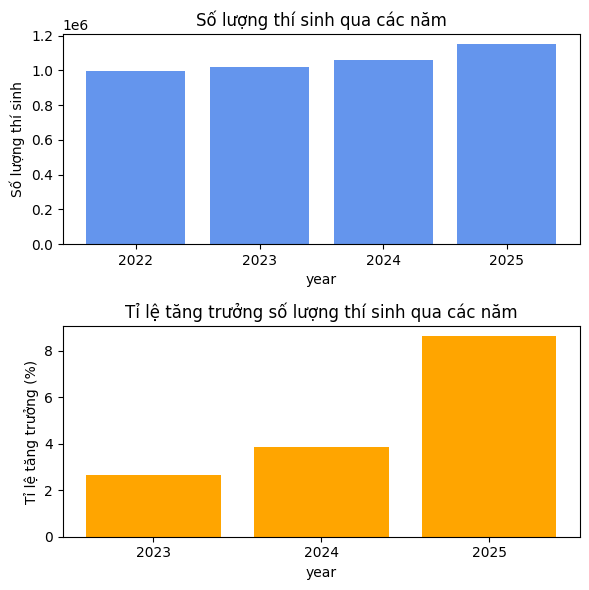

Từ năm 2022 đến 2025, số thí sinh tăng từ khoảng 1 triệu lên gần 1.2 triệu. Đặc biệt, năm 2025 có số lượng thí sinh cao nhất, tăng mạnh nhất lên đến ~8.6%. 
- **Score Distribution Over Year**: Phôi phối điểm của toàn bộ thí sinh qua các năm gần đây
  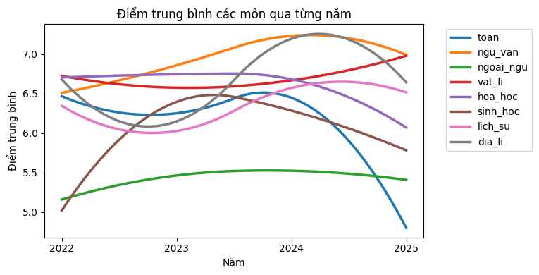

  **Xu hướng điểm trung bình các môn thi qua các năm:**

  - **Môn Toán**: Giảm mạnh nhất, từ khoảng 6.4 (2022) → 4.8 (2025). Đây là môn duy nhất có mức giảm sâu liên tục, cho thấy đề thi 2025 rất khó, gây ảnh hưởng đáng kể đến mặt bằng chung.

  - **Ngữ văn**: Tăng ổn định qua các năm, từ ~6.5 → gần 7.2, là môn có điểm trung bình cao nhất năm 2025. Đây là môn giữ phong độ ổn định và có xu hướng nâng cao chất lượng làm bài theo thời gian.

  - **Ngoại ngữ**: Cải thiện nhẹ từ 5.1 → 5.4 trong giai đoạn 2022–2024, nhưng giảm nhẹ lại ở năm 2025. Vẫn là môn có điểm trung bình thấp nhất trong 4 năm.

  - **Lý – Hóa – Sinh**: Đều có xu hướng giảm ở năm 2025:
    - **Vật lý**: Ổn định nhẹ rồi giảm về khoảng 6.0.
    - **Hóa học**: Giữ vững quanh mức 6.6, nhưng cũng giảm nhẹ năm 2025.
    - **Sinh học**: Tăng mạnh từ 5.0 (2022) lên 6.4 (2024), rồi giảm còn ~5.8 năm 2025.

  - **Lịch sử – Địa lý**: Có điểm trung bình cao nhất trong khối Khoa học Xã hội:
    - **Lịch sử**: Giữ ổn định quanh 6.2–6.6.
    - **Địa lý**: Đạt đỉnh gần 7.4 năm 2024, nhưng giảm nhẹ trong 2025, vẫn cao.

- **Subject Analysis**: Phân tích điểm theo từng môn thi
  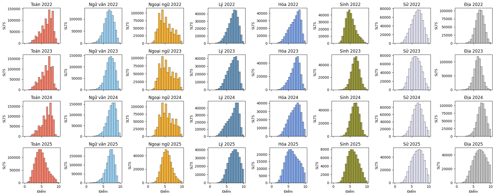
  - **Toán**:
  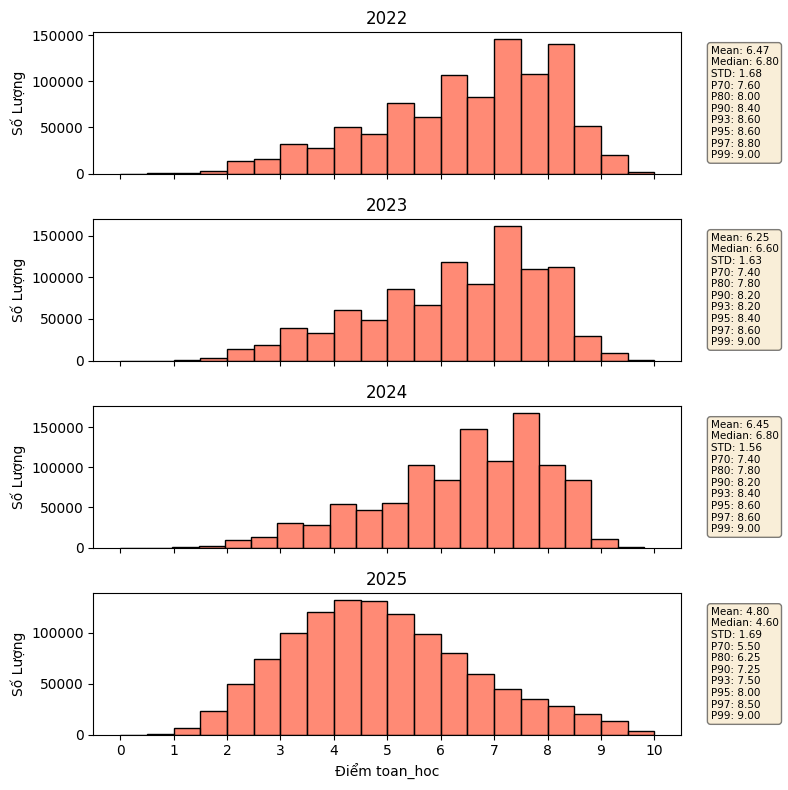
    - **Mức độ khó của đề thi**: Năm 2025, đề Toán được đánh giá là khó hơn so với các năm trước.
      - Mean giảm mạnh: từ mức 6.2–6.5 các năm trước → chỉ còn 4.80 năm 2025.
      - Median giảm sâu: chỉ 4.60, thấp nhất trong 4 năm qua.
      - Tức là >50% học sinh có điểm Toán dưới 4.6, khác biệt lớn so với mức 6.6–6.8 của các năm trước.
    - **Dạng phân phối điểm**: 
      - Các năm trước: phân bố lệch trái, nhiều học sinh đạt điểm cao.
      - Năm 2025: dạng chuẩn hóa, đỉnh rơi vào mức 4–5 điểm, ít học sinh vượt ngưỡng 7.
    - **Tỷ lệ học sinh đạt điểm cao**: 
      - Năm 2025, để lọt top 5% toàn quốc, học sinh cần đạt điểm Toán từ 8.0 trở lên, trong khi các năm trước dao động ở mức 8.4-8.6.
      - Trên 500 học sinh đạt điểm Toán 10 - tăng hơn 30 lần so với năm 2022 → cho thấy sự phân hóa rõ rệt giữa các nhóm học sinh (trung bình, khá với giỏi, xuất sắc).
        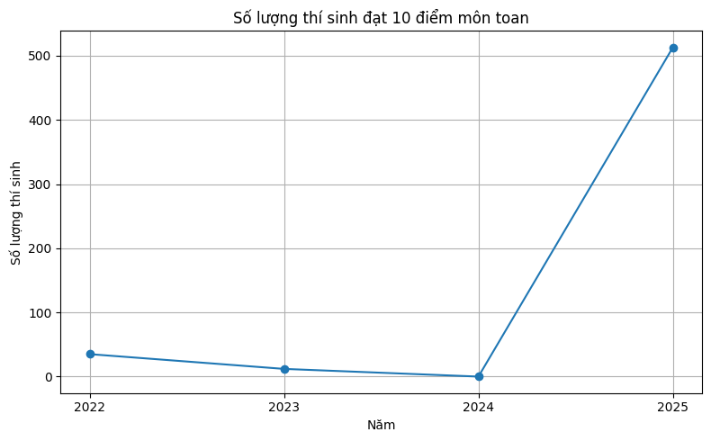
    - **Kết luận**: 
      - Đề Toán năm 2025 khó hơn toàn diện với đa số học sinh, làm kéo tụt điểm trung bình 
      - Phân hóa rõ rệt hơn so với các năm trước đã tạo ra sự cạnh tranh cao hơn so với top đầu, loại bỏ được nhiều học sinh học tủ, học lệch. 
      - Phân nhóm rõ ràng về trình độ học sinh, tạo cơ hội cho những học sinh thực sự xuất sắc.

  - **Văn**:
  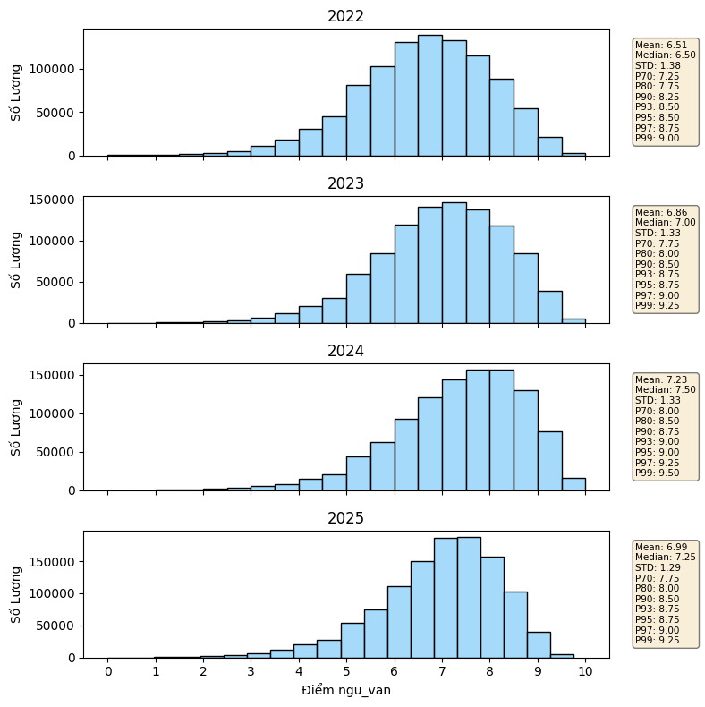
    - **Mức độ khó của đề thi**: Năm 2025, đề Ngữ Văn được đánh giá là khó hơn so với các năm trước, đặc biệt ở mức điểm cao.
      - Mean giảm nhẹ so với 2024: từ 7.23 (2024) → 6.99 (2025).
      - Median (trung vị) cũng giảm: từ 7.50 → 7.25, cho thấy mức phổ biến điểm thi thấp hơn.
      - Dù mức giảm không quá mạnh như môn Toán, nhưng vẫn phản ánh đề có độ phân hóa rõ hơn ở top điểm cao.
    - **Dạng phân phối điểm**: 
      - Từ 2022 đến 2024, phân phối điểm lệch trái rõ rệt (nhiều thí sinh đạt điểm cao, đỉnh phân bố lệch về phải).
      - Năm 2025: biểu đồ cho thấy phân phối cân bằng hơn (gần dạng chuẩn), đỉnh tập trung ở mức 7 điểm, ít thí sinh đạt trên 8.5.
    - **Tỷ lệ học sinh đạt điểm cao**: 
      - Năm 2022 có 5 học sinh đạt điểm 10 → cao nhất trong 4 năm.
      - Năm 2025 không có học sinh nào đạt điểm 10, giảm mạnh so với 2024 (2 học sinh), thể hiện rõ sự siết chặt chấm thi hoặc độ khó của đề.
        
    - **Kết luận**:
      - Đề Ngữ Văn năm 2025 có mức độ khó tăng lên ở nhóm học sinh giỏi – xuất sắc.
      - Phân phối điểm trở nên chuẩn hóa hơn, giảm hiện tượng "mưa điểm 9–10" như năm 2022.
      - Tỷ lệ đạt điểm 10 giảm về 0, cho thấy chấm thi nghiêm ngặt hơn và đề thi phân hóa tốt hơn.
      - Vì hình thức ra đề năm nay khác hơn so với mọi năm nên đã phát hiện ra nhiều hơn nhóm học sinh có năng lực thực sự, hạn chế học tủ, học thuộc máy móc.
  - **Ngoại Ngữ**:
  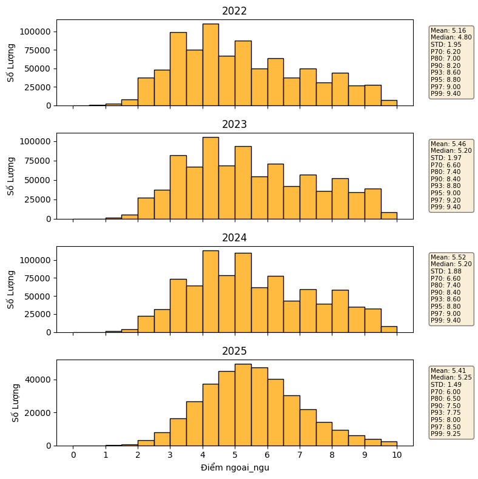
    - **Mức độ khó của đề thi**: Năm 2025, đề Ngoại ngữ được đánh giá có độ khó tăng lên, đặc biệt ở phần nâng cao.
      - Mean giảm nhẹ: từ 5.52 (2024) → 5.41 (2025), thấp hơn cả năm 2023 (5.46).
      - Độ lệch chuẩn STD = 1.49 (thấp nhất trong 4 năm), cho thấy đề thi hạn chế độ phân tán điểm, làm phổ điểm tập trung hơn.
      - Ít học sinh vượt trội so với các năm trước.
    - **Dạng phân phối điểm**: 
      - Các năm 2022–2024: phân bố lệch phải nhẹ, nhiều học sinh đạt 6–8 điểm, đuôi phân bố kéo dài về phía điểm cao.
      - Năm 2025: phân bố gần chuẩn hóa, đỉnh rơi vào mức 5–6 điểm, ít học sinh đạt điểm cao hoặc thấp cực trị.
    - **Tỷ lệ học sinh đạt điểm cao**: 
      - Số học sinh đạt điểm 10 giảm mạnh: từ 643 em (2024) → 417 em (2025, trong đó có 141 điểm 10 của môn tiếng Anh), mức thấp nhất trong 4 năm.
      - Cho thấy sự điều chỉnh độ khó rõ rệt ở phần nâng cao.
      - Top 5% học sinh toàn quốc năm 2025 đạt từ 8.0 trở lên, thấp hơn ngưỡng 8.4–8.8 của các năm trước.
      - Điểm số 9+ trở lên bị "nén mạnh", thể hiện qua các phân vị:
        - P95 giảm từ 8.8 (2022–2024) xuống 8.0 (2025).
        - P99 giảm từ 9.4 xuống 9.25.
      - Điều này cho thấy, đề thi năm 2025 hạn chế tối đa việc bứt phá điểm cao, tăng tính cạnh tranh ở phân khúc điểm giỏi.
      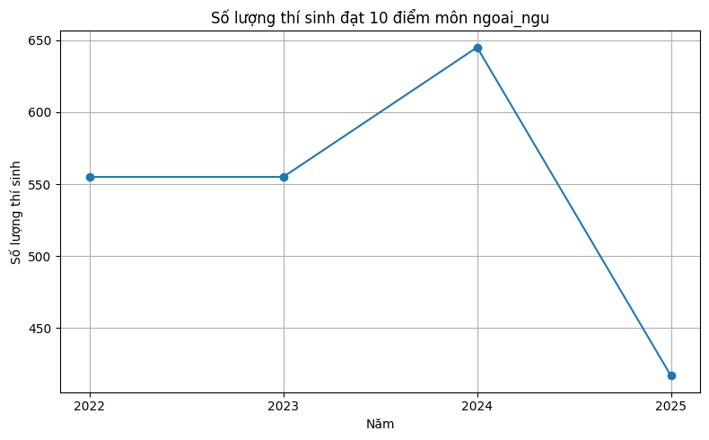
    - **Kết luận**: 
      - Đề Ngoại ngữ năm 2025 được thiết kế khó hơn phần nâng cao, đặc biệt là các câu phân loại học sinh giỏi → khiến cho lượng điểm tuyệt đối giảm mạnh.
      - Phổ điểm chuẩn hóa giúp phân loại năng lực học sinh đồng đều hơn, giảm "số lượng điểm cao ảo" như các năm trước.
      - Đây là xu hướng tích cực trong việc loại bỏ học tủ, học mẹo, và ưu tiên học sinh có nền tảng thực sự vững chắc.
  - **Lý**:
  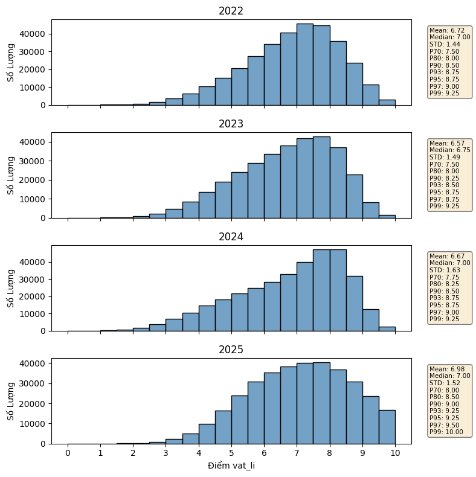
    - **Mức độ khó của đề thi**: Năm 2025, đề Vật lí được đánh giá là dễ hơn rõ rệt so với các năm trước.
      - Mean tăng nhẹ qua các năm: từ 6.57 (2023) → 6.67 (2024) → 6.98 (2025).
      - Median giữ ổn định ở mức 7.0, cho thấy hơn 50% học sinh đạt từ 7 điểm trở lên.
      - Điểm trung bình và trung vị đều cao hơn so với mặt bằng chung các môn thi năm nay → đề thi mang tính phân loại thấp hơn.
    - **Dạng phân phối điểm**: 
      - Các năm trước (2022–2024): Phân bố có dạng gần chuẩn, thiên lệch nhẹ về bên phải.
      - Năm 2025: Dạng phân phối lệch trái nhẹ, đỉnh rơi vào khoảng 6.5–7.5 điểm, đồng thời xuất hiện số lượng lớn học sinh đạt điểm cao.
      - Phân bố dày hơn ở nhóm điểm từ 8.0 trở lên, tạo sự "tụ" ở nhóm điểm cao.
    - **Tỷ lệ học sinh đạt điểm cao**: 
      - Điểm 10 Vật lí năm 2025 tăng vọt lên gần 4000 thí sinh, trong khi các năm trước dao động chỉ dưới 200 thí sinh.
      - Đây là mức tăng gấp gần 40 lần so với năm 2024, cho thấy đề thi năm nay dễ hơn rõ rệt ở phần điểm tuyệt đối.
      - Ngưỡng top 5% thí sinh toàn quốc năm 2025 là khoảng 9.25 điểm, cao hơn các năm trước (thường chỉ ở mức 8.75–9.0).
            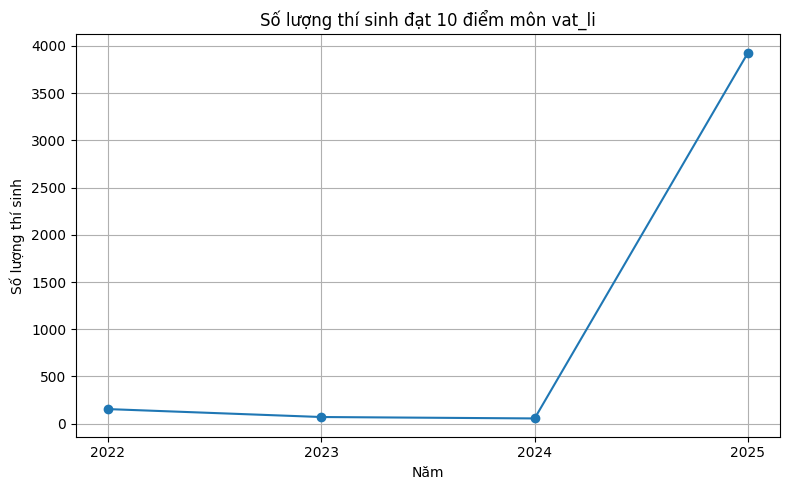
    - **Kết luận**: 
      - Đề thi Vật lí năm 2025 dễ hơn toàn diện so với các năm gần đây, tạo điều kiện cho học sinh đạt điểm cao.
      - Tuy nhiên, điều này cũng làm giảm hiệu quả phân loại, đặc biệt ở nhóm học sinh khá – giỏi – xuất sắc.
      - Cần lưu ý khi sử dụng điểm Vật lí để xét tuyển đại học năm nay, vì có khả năng xảy ra hiện tượng "vỡ trận" điểm chuẩn với các khối ngành có môn Vật lí.
  - **Hóa**:
  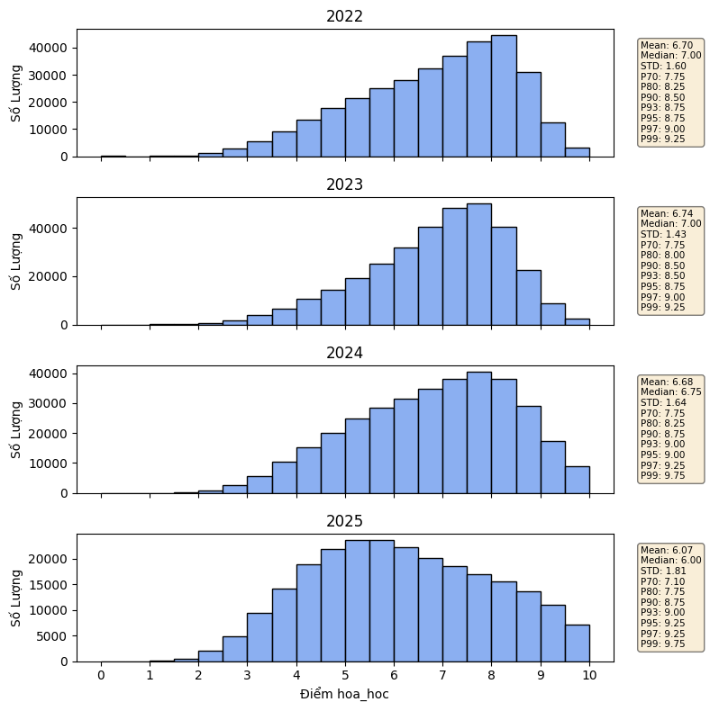
    - **Mức độ khó của đề thi**: Đề Hóa năm 2025 được đánh giá là khó hơn đáng kể so với 3 năm trước.
      - Mean giảm mạnh: từ khoảng 6.68–6.74 các năm 2022–2024 → còn 6.07 vào năm 2025.
      - Median cũng giảm: từ 7.00 và 6.75 các năm trước → còn 6.00 trong năm 2025.
      - Điều này cho thấy >50% thí sinh có điểm Hóa dưới 6, trong khi các năm trước phần lớn nằm ở mức 6.75–7.
    - **Dạng phân phối điểm**:
      - 2022–2024: phân bố lệch trái, đỉnh phân phối rơi vào mức 7–8, nhiều thí sinh đạt điểm khá – giỏi.
      - 2025: phân bố dạng chuẩn hoá, đỉnh rơi vào mức 5–6, cho thấy đề có tính phân hoá mạnh hơn và ít học sinh đạt điểm cao.
    - **Tỷ lệ học sinh đạt điểm cao**:
      - Số lượng học sinh đạt 10 điểm Hóa năm 2025 là khoảng 630, giảm gần một nửa so với đỉnh 2024 (~1290 thí sinh).
      - Trong khi 2022–2023 chỉ có hơn 100 thí sinh đạt điểm tuyệt đối → cho thấy đề 2024 dễ bất thường, còn 2025 đã trở lại với tính phân hoá.
      - Để vào nhóm top 5% toàn quốc năm 2025, học sinh cần đạt từ 9.25 trở lên, cao hơn so với ngưỡng 9.0 của các năm trước do sự rút gọn số lượng điểm cao.
      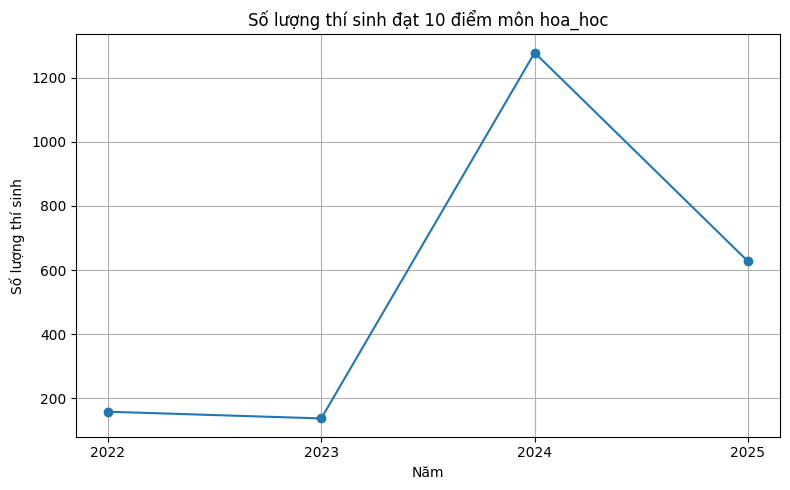
    - **Kết luận**:
      - Đề Hóa năm 2025 được thiết kế lại để tăng tính phân hóa, hạn chế tình trạng "mưa điểm 10" như năm 2024.
      - Sự sụt giảm cả mean, median và số điểm 10 cho thấy tính ổn định và độ khó cao hơn, góp phần làm rõ ranh giới giữa học sinh trung bình – khá – giỏi.
      - Đây là tín hiệu tích cực về mặt kỹ thuật ra đề, giúp đánh giá đúng năng lực học sinh và phục vụ tốt hơn cho công tác tuyển sinh đại học.
  - **Sinh**:
  
    - **Mức độ khó của đề thi**: Năm 2025, đề Sinh học được đánh giá là khó hơn so với hai năm liền kề trước (2023 và 2024).
      - Mean giảm xuống còn 5.78, thấp hơn so với mức 6.28–6.39 của hai năm trước.
      - Median cũng giảm xuống 5.75, cho thấy hơn 50% học sinh đạt điểm dưới mức này.
      - So với năm 2022 (Mean 5.02, Median 4.75), đề 2025 vẫn dễ hơn đôi chút, nhưng rõ ràng khó hơn hai năm gần nhất.
    - **Dạng phân phối điểm**:
      - Năm 2023 và 2024: phân phối lệch trái, tập trung ở ngưỡng 6–7 điểm → dễ hơn.
      - Năm 2025: phân phối dạng chuẩn hóa, đỉnh rơi vào 5–6 điểm, ít học sinh vượt qua mốc 8 điểm.
      - Điều này cho thấy đề đã làm tốt vai trò giảm điểm ảo, phân loại tốt hơn.
    - **Tỷ lệ học sinh đạt điểm cao**:
      - Để vào top 5% toàn quốc năm 2025, học sinh cần đạt từ 8.0 trở lên, tương đương năm 2024.
      - Số lượng thí sinh đạt điểm 10 năm 2025 là 82, tăng gần 2.5 lần so với 2024 (34), nhưng vẫn thấp hơn rất nhiều so với đỉnh 2023 (135).
      - Đây là mức điều chỉnh hợp lý, tránh hiện tượng quá nhiều điểm tuyệt đối, nhưng vẫn đảm bảo có học sinh xuất sắc vượt trội.
      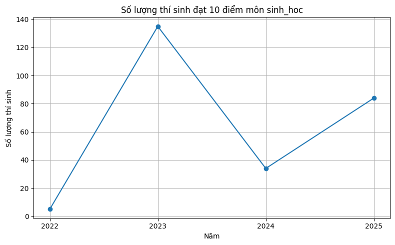
    - **Kết luận**:
      - Đề Sinh học năm 2025 có độ khó tăng so với 2023–2024, khiến điểm trung bình và trung vị đều giảm.
      - Phân phối điểm dạng chuẩn giúp phân hóa tốt giữa các nhóm học sinh trung bình – khá – giỏi.
      - Sự điều chỉnh này góp phần nâng cao tính công bằng, hạn chế học lệch, và tạo điều kiện cho học sinh có nền tảng thực sự vươn lên trong xét tuyển đại học.
  - **Sử**:
  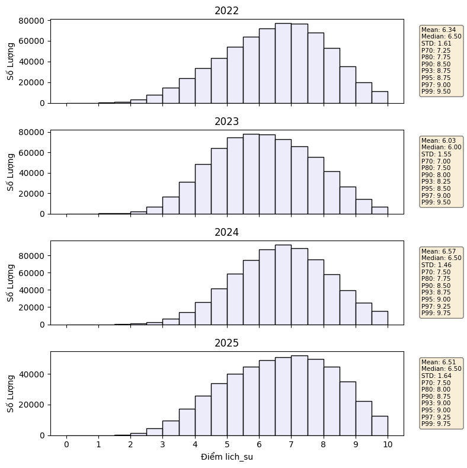
    - **Mức độ khó của đề thi**: Năm 2025, đề Lịch sử được đánh giá là tương đương hoặc nhỉnh hơn đôi chút so với các năm trước.
      - Mean năm 2025 là 6.51, tuy giảm nhẹ so với 2024 (6.57) nhưng vẫn cao hơn rõ rệt so với năm 2023 (6.03) và năm 2022 (6.34).
      - Median duy trì ở mức 6.50, cho thấy mức phổ điểm ổn định, không có sự sụt giảm đáng kể.
    - **Dạng phân phối điểm**:
      - Năm 2022–2024: phân phối có xu hướng chuẩn hóa, đỉnh nằm ở 6–7.5 điểm, trải rộng từ 3 đến 9.75 điểm.
      - Năm 2025: phân bố gần chuẩn nhưng lệch phải nhẹ, đỉnh rơi vào vùng 6–7 điểm, cho thấy học sinh đạt mức trung bình khá là nhiều nhất.
      - Các năm đều có độ phân tán hợp lý, nhưng năm 2025 có độ lệch nhẹ về bên phải (nhiều điểm cao hơn).
    - **Tỷ lệ học sinh đạt điểm cao**:
      - Năm 2024 là đỉnh điểm với hơn 2,100 học sinh đạt điểm 10.
      - Năm 2025 có khoảng 1,650 thí sinh đạt điểm 10, giảm nhẹ nhưng vẫn cao so với mặt bằng chung các năm.
      - So với năm 2023 chỉ có ~790 thí sinh đạt điểm 10, thì năm 2025 cho thấy mức độ "dễ lấy điểm cao" hơn đáng kể.
      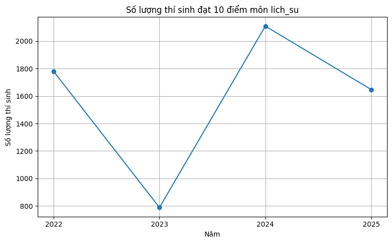
    - **Kết luận**:
      - Đề thi Lịch sử năm 2025 duy trì mức độ khó vừa phải, không quá gắt như năm 2023.
      - Phân bố điểm ổn định, ít biến động, giúp đánh giá được năng lực học sinh rõ ràng hơn.
      - Tỷ lệ điểm 10 vẫn cao, nhưng có xu hướng giảm nhẹ cho thấy đề thi có điều chỉnh để tránh "mưa điểm 10" như năm 2024.
      - Phù hợp cho mục tiêu xét tuyển đại học, đồng thời vẫn đảm bảo tính phân loại đối tượng học sinh khá – giỏi.
  - **Địa**:
    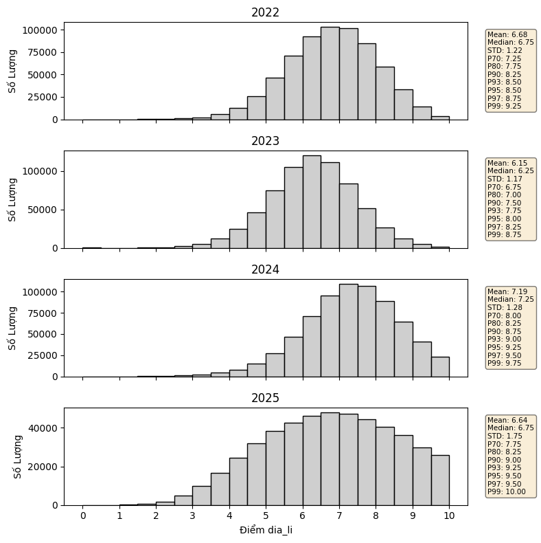
      - **Mức độ khó của đề thi**: Năm 2025, đề Địa lí có mức độ dễ hơn đáng kể so với năm 2023, tương đương năm 2022 và thấp hơn đôi chút so với 2024.
        - Mean năm 2025 là 6.64, gần bằng 2022 (6.68), cao hơn nhiều so với năm 2023 (6.15) và thấp hơn một chút so với năm 2024 (7.19).
        - Median giữ ổn định ở 6.75, cho thấy phân nửa thí sinh đạt trên mức này.
      - **Dạng phân phối điểm**:
        - Năm 2022–2024: phân phối có xu hướng lệch trái nhẹ, đỉnh điểm rơi vào mức 6.5–7.5, thể hiện số đông học sinh đạt điểm khá.
        - Năm 2025: phân phối gần chuẩn hóa, trải rộng đều từ 4 đến 10 điểm, với đỉnh rơi vào khoảng 7 điểm, nhưng có phần kéo dài về phía điểm cao (9–10), cho thấy đề dễ hơn và ít phân hóa hơn.
      - **Tỷ lệ học sinh đạt điểm cao**:
        - Số học sinh đạt điểm 10 năm 2025 tăng vọt, vượt 7.000 thí sinh, gấp ~20 lần so với 2024 và hàng trăm lần so với năm 2023 (chỉ vài chục em).
        - Điểm 9.0+ cũng tăng mạnh, với percentiles P95–P99 đều chạm ngưỡng 9.0–10.0, cho thấy nhiều học sinh vượt ngưỡng xuất sắc.
        - Mức phân hóa điểm cao giảm, tăng khả năng cạnh tranh giữa các thí sinh top đầu.
        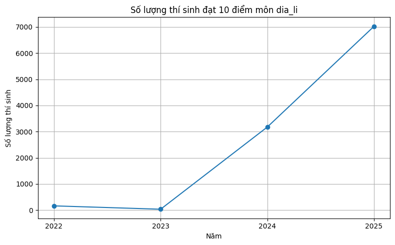
      - **Kết luận**:
        - Đề Địa lí năm 2025 dễ hơn, thiên về kiến thức cơ bản – phản ánh rõ qua số lượng điểm 10 tăng đột biến.
        - Tuy nhiên, phân hóa giảm, dẫn đến khó phân biệt trình độ thực sự của thí sinh top cao.
        - Thí sinh giỏi cần đạt điểm gần tuyệt đối để nổi bật, tạo áp lực lớn trong xét tuyển khối ngành có môn Địa lí.

- **Compare With Previous Years**: So sánh điểm thi 2025 với các năm trước
  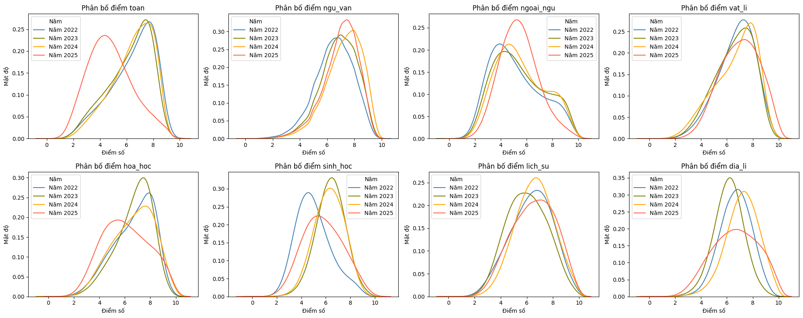

### **Group distribution**
- **Combo**: Phân tích điểm theo các tổ hợp phổ biến
  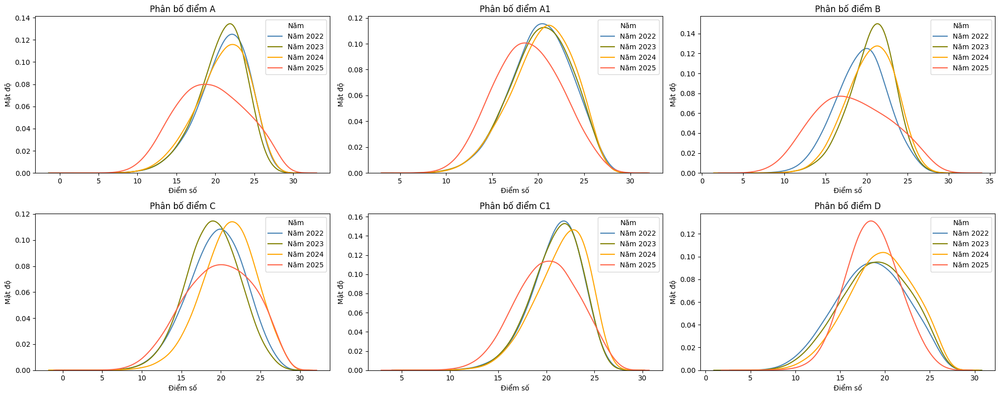
  **1. Tổ hợp A00 (Toán - Lý - Hóa):**
  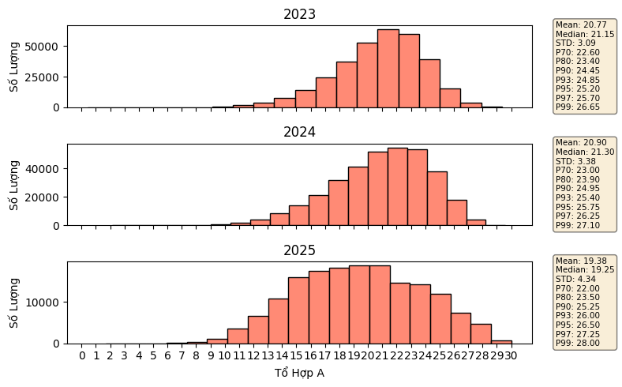
  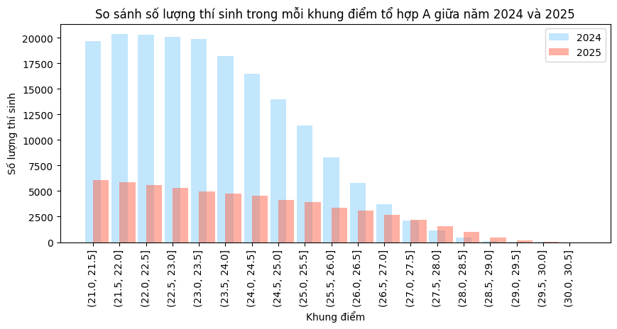
  - **Thống kê mô tả:**
    - Dạng phân phối:
      - Năm 2023 & 2024: phân phối hơi lệch trái, đỉnh nằm gần trung bình (mean ≈ 21).
      - Năm 2025: phân phối gần như chuẩn hóa nhưng dẹt hơn và trải rộng hơn, do độ lệch chuẩn tăng lên (STD 4.44).
      → Điều này cho thấy điểm thi phân tán hơn, độ phân hóa cao hơn.
    - Tổng thể, năm 2025 có:
      - Điểm trung bình giảm rõ rệt (~1.5 điểm so với 2024).
      - Độ lệch chuẩn tăng mạnh, chứng tỏ khoảng cách giữa các thí sinh rõ ràng hơn.
      - Phân phối phẳng và đều, ít tập trung thí sinh ở một mức điểm cụ thể.
  - **Số lượng thí sinh trong range điểm top 5% (từ P95 trở lên):**
    - **Ngưỡng P95 (Top 5% toàn quốc):**
      - 2023: 25.80 điểm
      - 2024: 25.75 điểm  
      - 2025: 26.50 điểm → tăng 0.7 điểm so với các năm trước
    - **Số lượng thí sinh đạt top 5%:**
      - Dựa trên biểu đồ phân phối, năm 2025 có số lượng thí sinh từ 26.5 điểm trở lên rất ít (các cột từ 26.5-30 đều dưới 1000 thí sinh).
      - Ước tính chỉ có khoảng **2.500–3.000 thí sinh toàn quốc** đạt ngưỡng top 5% (≥26.5 điểm).
      - **Dự đoán điểm chuẩn các trường top đầu/ngành hot (đánh giá chung):**
        - **Nếu xét riêng tổ hợp A00:**
          - Với phổ điểm thấp hơn, độ phân hóa cao, các ngành/trường top A00 có thể giữ hoặc giảm nhẹ điểm chuẩn.
          - **Dự đoán:**
            - Ngưỡng điểm chuẩn các ngành hot có thể dao động từ **25.5–27.0**, tùy mức độ tuyển chọn.
            - Chỉ những thí sinh thuộc **top 3–5%** mới có khả năng trúng tuyển.
            - Điểm 27+ sẽ cực kỳ hiếm, có thể là điểm "gần tuyệt đối".
        - **Nếu tổ hợp A00 phải cạnh tranh với các tổ hợp khác (như A01, D01):**
          - Do tổ hợp A00 ít thí sinh điểm cao hơn rõ rệt, nếu các tổ hợp khác giữ phân phối ổn định → A00 sẽ yếu thế hơn khi xét tuyển cùng nhóm.
          - Khả năng các trường ưu tiên xét tổ hợp có phổ điểm cao hơn (nếu không quy đổi điểm chuẩn riêng theo tổ hợp).

  **2. Tổ hợp A01 (Toán - Lý - Anh):**
  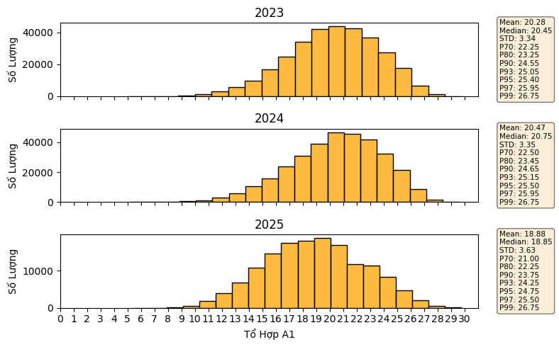
  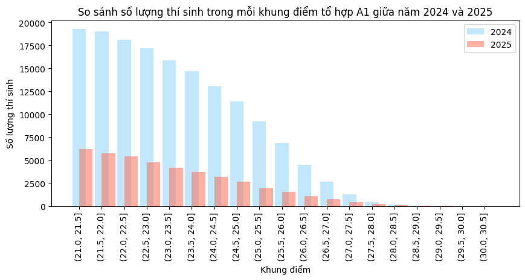
    - **Thống kê mô tả:**
      - Dạng phân phối:
        - Năm 2023 & 2024: phân phối lệch trái nhẹ, tập trung nhiều ở vùng điểm trung bình (mean ≈ 20.3–20.5), đỉnh phân bố gần giá trị trung bình → cho thấy phần lớn thí sinh đạt điểm trung bình khá.
        - Năm 2025: phân phối gần chuẩn hóa nhưng dẹt hơn và trải rộng hơn. Đỉnh phân bố thấp hơn (≈ 19), và độ lệch chuẩn tăng lên (STD 3.63) → cho thấy mức độ phân hóa tăng, phổ điểm phân tán nhiều hơn.
      - Tổng thể, năm 2025 có:
        - Điểm trung bình giảm rõ rệt (~1.6 điểm so với 2024).
        - Độ lệch chuẩn tăng (3.63 so với 3.35), phản ánh sự chênh lệch rõ rệt hơn giữa các nhóm thí sinh.
        - Phân phối điểm phẳng và đều, không còn hiện tượng dồn cục ở vùng điểm trung bình như 2 năm trước.
    - **Số lượng thí sinh trong range điểm top 5% (từ P95 trở lên):**
      - **Ngưỡng P95 (Top 5% toàn quốc):**
        - 2023: 25.40 điểm
        - 2024: 25.50 điểm
        - 2025: 24.75 điểm → giảm khoảng 0.75 điểm so với các năm trước
      - **Số lượng thí sinh đạt top 5%:**
        - Dựa trên biểu đồ phân phối, năm 2025 chỉ có số lượng nhỏ thí sinh từ 24.75 điểm trở lên.
        - Từ biểu đồ so sánh (sltsA1.png), thấy rõ rằng số lượng thí sinh đạt từ 25 điểm trở lên giảm mạnh, nhất là từ mốc 26.5 điểm → các cột ở mức này đều dưới 1.000 người.
        - Ước tính số thí sinh đạt top 5% (≥24.75 điểm) rơi vào khoảng **7.000–8.000**, giảm so với năm 2024 (khoảng 10.000–12.000).
        - **Dự đoán điểm chuẩn các trường top đầu/ngành hot (đánh giá chung):**
          - **Nếu xét riêng tổ hợp A01:**
            - Phổ điểm năm 2025 có xu hướng dàn đều, không tập trung đỉnh, nên việc phân loại thí sinh theo mức điểm sẽ rõ ràng hơn.
            - Dù điểm trung bình giảm, nhưng độ phân hóa tăng → các trường top vẫn có thể duy trì ngưỡng tuyển cao nhờ chọn được thí sinh nổi bật.
            - **Dự đoán:**
              - Điểm chuẩn các ngành hot có thể dao động trong khoảng **24.5–26.5**.
              - Điểm 26.5+ trở thành điểm rất cao, đại diện cho top 1–2%.
              - Sự cạnh tranh sẽ tăng ở ngưỡng 24–25.5, nơi có đông thí sinh nhất.
          - **Nếu tổ hợp A01 phải cạnh tranh với các tổ hợp khác (A00, D01…):**
            - Do tổ hợp A01 năm 2025 không có nhiều thí sinh điểm cao vượt trội, nếu các tổ hợp khác (như D01, A00) có phân phối điểm ổn định → A01 có thể yếu thế hơn khi xét tuyển đồng thời.
            - Với các trường không quy đổi điểm chuẩn theo tổ hợp, khả năng thí sinh A01 bị cạnh tranh mạnh ở các ngành hot là rất cao.
            - Trường hợp xét theo tổ hợp riêng, điểm chuẩn A01 nhiều khả năng sẽ thấp hơn 0.5–1.0 điểm so với A00/D01.

  **3. Tổ hợp B00 (Toán - Hóa - Sinh):**
  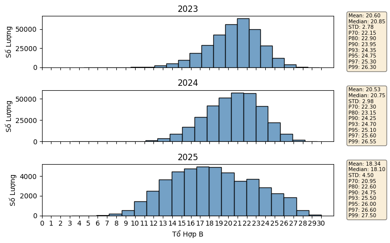
  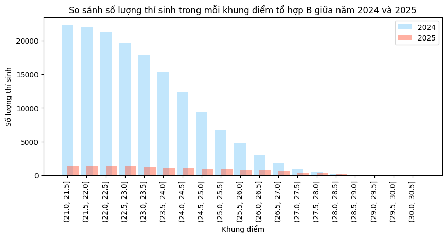
  - **Thống kê mô tả:**
    - Dạng phân phối:
      - Năm 2023 & 2024: phân phối hơi lệch trái, đỉnh nằm gần trung bình (mean ≈ 20.5), cho thấy phần lớn thí sinh đạt mức điểm trung bình khá.
      - Năm 2025: phân phối gần như chuẩn hóa nhưng dẹt hơn và trải rộng hơn, với độ lệch chuẩn tăng mạnh (STD = 4.50).
      → Điều này phản ánh phổ điểm dàn đều, thể hiện rõ sự phân hóa cao, mức độ chênh lệch giữa các thí sinh lớn hơn.
    - Tổng thể, năm 2025 có:
      - Điểm trung bình giảm đáng kể (chỉ 18.34, giảm ~2.2 điểm so với 2024).
      - Độ lệch chuẩn tăng cao (STD = 4.50), cho thấy khoảng cách giữa thí sinh rõ rệt hơn.
      - Dạng phân phối không còn tập trung quanh một mức điểm cụ thể mà phân tán đều hơn → tăng độ khó trong việc đánh giá cạnh tranh.
  - **Số lượng thí sinh trong range điểm top 5% (từ P95 trở lên):**
    - **Ngưỡng P95 (Top 5% toàn quốc):**
      - 2023: 25.80 điểm
      - 2024: 25.75 điểm
      - 2025: 26.50 điểm → tăng 0.7 điểm so với các năm trước, mặc dù phổ điểm chung giảm.
      → Điều này chứng tỏ phân khúc thí sinh top đầu ít nhưng rất mạnh, kéo P95 lên cao.
    - **Số lượng thí sinh đạt top 5%:**
      - Theo biểu đồ histogram 2025, các cột điểm từ 26.5 trở lên đều thấp hơn 500 thí sinh, và tổng số các thí sinh từ mức này rất hạn chế.
      - Ước tính chỉ có khoảng **2.000–3.000 thí sinh** trên toàn quốc đạt mức điểm từ 26.5 trở lên.
      - Biểu đồ so sánh 2024 vs 2025 cho thấy: số lượng thí sinh điểm cao năm 2025 giảm mạnh, đặc biệt trong các khung từ 22 điểm trở lên.
      - **Dự đoán điểm chuẩn các trường top đầu/ngành hot (đánh giá chung):**
        - **Nếu xét riêng tổ hợp B00:**
          - Với phổ điểm thấp, dàn trải và ít điểm cao, các trường/ngành top sẽ có xu hướng giảm nhẹ điểm chuẩn, hoặc giữ nguyên nếu vẫn muốn chọn lọc thí sinh giỏi thật sự.
          - **Dự đoán:**
            - Các ngành y dược, sinh học top đầu có thể lấy trong khoảng **25.0–26.5** điểm.
            - Những ngành trung bình khá có thể dao động trong mức **22.5–24.5**.
            - Điểm từ 27 trở lên gần như tuyệt đối, chỉ vài chục thí sinh đạt được.
        - **Nếu tổ hợp B00 cạnh tranh cùng các tổ hợp khác (A00, D01...):**
          - Do tổ hợp B00 có ít thí sinh điểm cao hơn rõ rệt, khả năng cạnh tranh sẽ thấp hơn nếu xét tuyển không phân tổ hợp.
          - Nếu các tổ hợp khác như A00/A01 có phân phối ổn định hơn → dễ chiếm ưu thế trong xét tuyển nếu trường không quy định rõ ưu tiên theo tổ hợp.

  **4. Tổ hợp C00 (Văn - Sử - Địa):**
    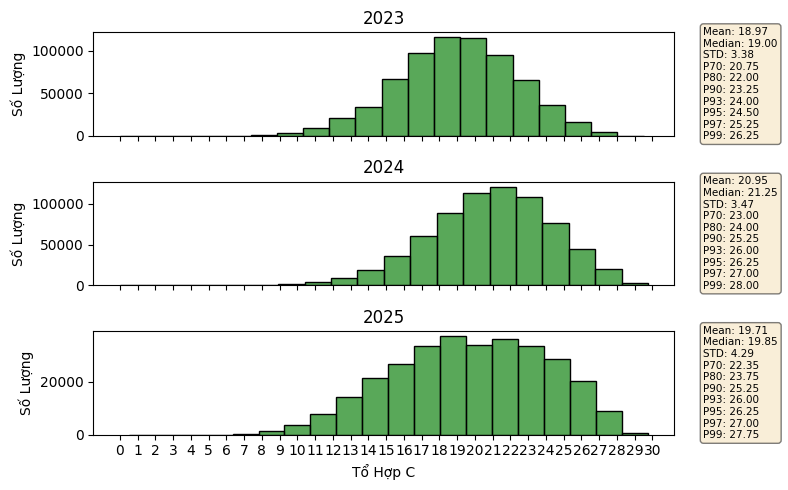
    
    - **Thống kê mô tả:**
      - Dạng phân phối:
        - Năm 2023 & 2024: phân phối lệch trái nhẹ, đỉnh nằm gần trung bình (mean ≈ 19–21), mật độ tập trung cao trong khoảng 18–24 điểm.
        - Năm 2025: phân phối gần chuẩn hóa hơn, tuy nhiên có xu hướng dẹt và trải rộng, với đỉnh khá đều từ 17–23 điểm.
        → Cho thấy phổ điểm năm 2025 phân tán hơn, độ phân hóa cao hơn rõ rệt so với 2 năm trước.
      - Tổng thể, năm 2025 có:
        - Điểm trung bình giảm nhẹ so với 2024 (19.71 so với 20.95).
        - Độ lệch chuẩn tăng mạnh (4.29 so với 3.47), chứng tỏ sự phân bố điểm rộng hơn.
        - Phân phối trải rộng, không còn đỉnh rõ rệt như các năm trước → thí sinh không còn tập trung ở một mốc điểm nhất định, tăng tính phân hóa.
    - **Số lượng thí sinh trong range điểm top 5% (từ P95 trở lên):**
      - **Ngưỡng P95 (Top 5% toàn quốc):**
        - 2023: 25.25 điểm
        - 2024: 26.25 điểm
        - 2025: 26.25 điểm → giữ nguyên so với năm 2024
      - **Số lượng thí sinh đạt top 5%:**
        - Dựa vào biểu đồ cột so sánh giữa năm 2024 và 2025, có thể thấy từ mức 26.0 điểm trở lên, số thí sinh năm 2025 giảm mạnh, mỗi cột đều thấp hơn rõ rệt so với 2024.
        - Ước tính: chỉ có khoảng **2.000–2.500 thí sinh** đạt từ 26.25 điểm trở lên trong năm 2025.
        - **Dự đoán điểm chuẩn các trường top đầu/ngành hot (đánh giá chung):**
          - **Nếu xét riêng tổ hợp C00:**
            - Với phổ điểm trải rộng và phân hóa cao, điểm chuẩn sẽ có xu hướng giữ nguyên hoặc giảm nhẹ, nhưng vẫn đảm bảo tính sàng lọc cao.
            - **Dự đoán:**
              - Các ngành hot/trường top sử dụng tổ hợp C00 có thể có ngưỡng điểm chuẩn dao động trong khoảng **25.0–26.5**.
              - Chỉ những thí sinh thuộc **top 5%** mới có khả năng trúng tuyển vào ngành top đầu.
              - Mức điểm 27+ gần như rất hiếm, chỉ xuất hiện ở nhóm cực kỳ xuất sắc.
          - **Nếu tổ hợp C00 phải cạnh tranh với các tổ hợp khác trong cùng nhóm ngành (A00, D01...):**
            - Do năm 2025, số thí sinh điểm cao ở tổ hợp C00 giảm mạnh hơn so với D01 hay A01 → tổ hợp C00 sẽ ở thế yếu hơn nếu không có chính sách quy đổi rõ ràng.
            - Nếu trường không xét riêng theo tổ hợp hoặc quy đổi, tổ hợp C00 có thể bị giảm tỷ trọng trúng tuyển trong nhóm ngành cạnh tranh.

  **5. Tổ hợp C01 (Toán - Văn - Lý):**
  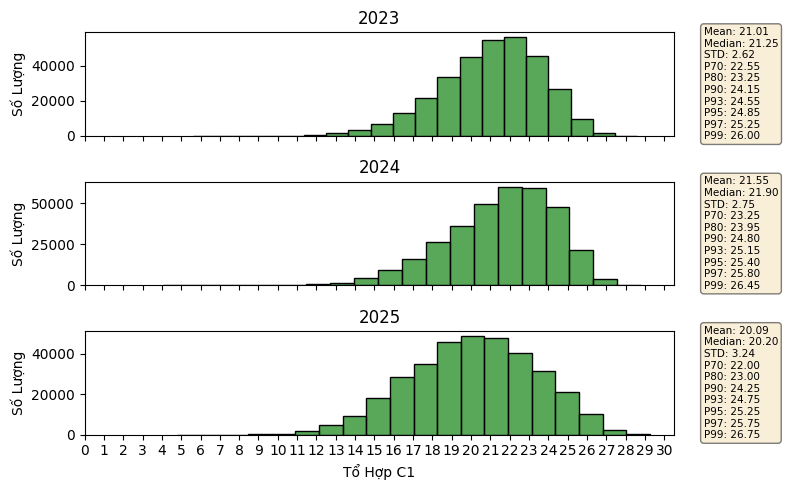
  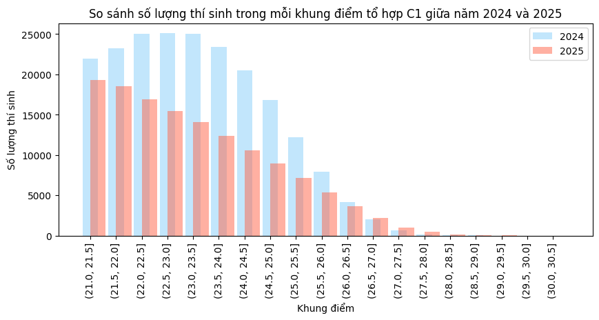
  - **Thống kê mô tả:**
    - Dạng phân phối:
      - Năm 2023 & 2024: phân phối hơi lệch trái, đỉnh nằm gần trung bình (mean ≈ 21).
      - Năm 2025: phân phối gần như chuẩn hóa nhưng dẹt hơn và trải rộng hơn, do độ lệch chuẩn tăng lên (STD 3.24).
      → Điều này cho thấy điểm thi phân tán hơn, độ phân hóa cao hơn.
    - Tổng thể, năm 2025 có:
      - Điểm trung bình giảm rõ rệt (~1.5 điểm so với 2024).
      - Độ lệch chuẩn giảm nhẹ so với 2024 nhưng phân phối vẫn trải rộng.
      - Phổ điểm đều, không có đỉnh rõ ràng như các năm trước.
  - **Số lượng thí sinh trong range điểm top 5% (từ P95 trở lên):**
    - **Ngưỡng P95 (Top 5% toàn quốc):**
      - 2023: 25.80 điểm
      - 2024: 25.75 điểm
      - 2025: 26.75 điểm → tăng đáng kể, cao hơn khoảng 1.0 điểm so với 2024.
    - **Số lượng thí sinh đạt top 5%:**
      - Dựa trên biểu đồ cột so sánh 2024 vs 2025, từ mốc 26.5 điểm trở lên, số lượng thí sinh rất ít, đặc biệt năm 2025.
      - Hầu hết các cột từ 26.5 đến 30 điểm đều dưới 1.000 thí sinh, nhiều cột gần như tiệm cận 0.
      - Ước tính chỉ có khoảng **2.000–2.500 thí sinh** cả nước đạt từ 26.75 điểm trở lên trong tổ hợp C1 năm 2025.
      - **Dự đoán điểm chuẩn các trường top đầu/ngành hot (đánh giá chung):**
        - **Nếu xét riêng tổ hợp C1:**
          - Phổ điểm dàn trải, ít thí sinh điểm cao, độ phân hóa rõ rệt → các trường sẽ dễ chọn lọc hơn.
          - **Dự đoán:**
            - Điểm chuẩn các ngành/trường top sử dụng tổ hợp C1 có thể nằm trong khoảng **25.5–27.5**.
            - Những thí sinh từ 26.5 điểm trở lên thuộc nhóm top đầu, nhiều khả năng trúng tuyển vào ngành hot.
        - **Nếu tổ hợp C1 phải cạnh tranh với các tổ hợp khác (D14, C00...):**
          - Nếu các tổ hợp kia có phổ điểm ổn định hoặc nhiều thí sinh điểm cao hơn → C1 sẽ yếu thế.
          - Trong trường hợp không quy đổi điểm theo tổ hợp, các ngành/trường có thể ưu tiên tổ hợp có phổ điểm cao hơn để đảm bảo mặt bằng tuyển sinh.

  **6. Tổ hợp D01 (Toán - Văn - Anh):**
  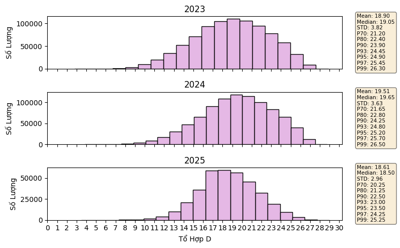
  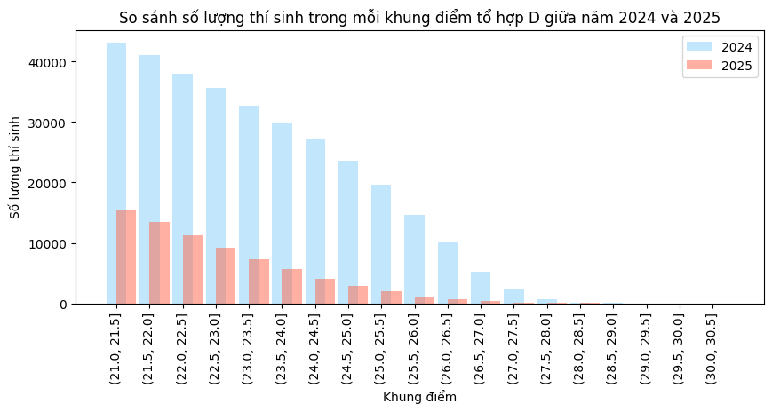
  - **Thống kê mô tả:**
    - Dạng phân phối:
      - Năm 2023 & 2024: phân phối hơi lệch trái, đỉnh nằm gần trung bình (mean ≈ 19–19.5).
      - Năm 2025: phân phối gần chuẩn hóa nhưng dẹt hơn, trải rộng hơn và thấp hơn, do độ lệch chuẩn tăng lên (STD 2.96).
      → Điều này cho thấy mức điểm của thí sinh phân tán hơn, độ phân hóa cao hơn.
    - Tổng thể, năm 2025 có:
      - Điểm trung bình giảm nhẹ (~0.9 điểm so với 2024), từ 19.51 → 18.61.
      - Độ lệch chuẩn tăng, cho thấy khoảng cách giữa các nhóm thí sinh rõ ràng hơn.
      - Phổ điểm phẳng hơn, ít thí sinh tập trung quanh một mốc điểm cụ thể như các năm trước.
  - **Số lượng thí sinh trong range điểm top 5% (từ P95 trở lên):**
    - **Ngưỡng P95 (Top 5% toàn quốc):**
      - 2023: 25.70 điểm
      - 2024: 25.80 điểm
      - 2025: 25.25 điểm → giảm khoảng 0.5 điểm so với năm trước.
    - **Số lượng thí sinh đạt top 5%:**
      - Dựa trên biểu đồ phân phối và biểu đồ cột so sánh:
        - Các cột từ 25.25 điểm trở lên năm 2025 đều rất thấp, thấp hơn đáng kể so với 2024.
        - Ước tính chỉ có khoảng **2.000–2.500 thí sinh** toàn quốc đạt ngưỡng từ 25.25 điểm trở lên (top 5%).
        - Số lượng thí sinh 27+ gần như tiệm cận 0, rất hiếm gặp.
      - **Dự đoán điểm chuẩn các trường top đầu/ngành hot (đánh giá chung):**
        - **Nếu xét riêng tổ hợp D01:**
          - Với mức phân hóa cao và điểm trung bình thấp hơn, các ngành/trường top dùng tổ hợp D01 có thể sẽ hạ nhẹ ngưỡng điểm chuẩn.
          - **Dự đoán:**
            - Các ngành hot xét theo tổ hợp D01 có thể dao động trong khoảng **24.5–26.5** điểm.
            - Top 3–5% thí sinh có cơ hội trúng tuyển cao.
            - Ngưỡng từ 27 trở lên gần như không còn phổ biến, chỉ dành cho thí sinh cực kỳ xuất sắc.
        - **Nếu tổ hợp D01 phải cạnh tranh với các tổ hợp khác (A01, A00…):**
          - Do phổ điểm D01 năm 2025 thấp hơn rõ rệt ở vùng điểm cao so với 2024 → tổ hợp D01 có thể gặp bất lợi nếu xét tuyển chung.
          - Trường hợp không điều chỉnh theo tổ hợp, các tổ hợp khác có nhiều thí sinh điểm cao hơn sẽ chiếm ưu thế.
          - **Khuyến nghị:** Nên quy đổi/chuẩn hóa điểm theo tổ hợp hoặc xét riêng để đảm bảo công bằng.   

  **7. Heatmap**: So sánh phân bố điểm giữa các tổ hợp và các năm
  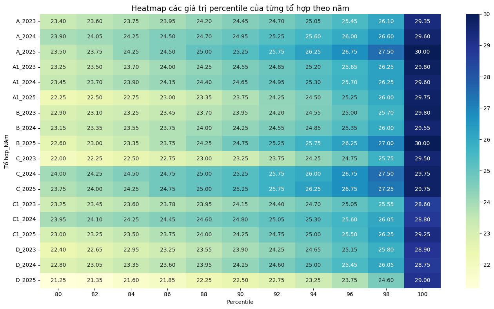       
- **Correlation**: Xem xét mối tương quan giữa các môn trong cùng tổ hợp, các tổ hợp với nhau
  - **Correlation between subjects**: Xem xét mối tương quan giữa các môn thi
  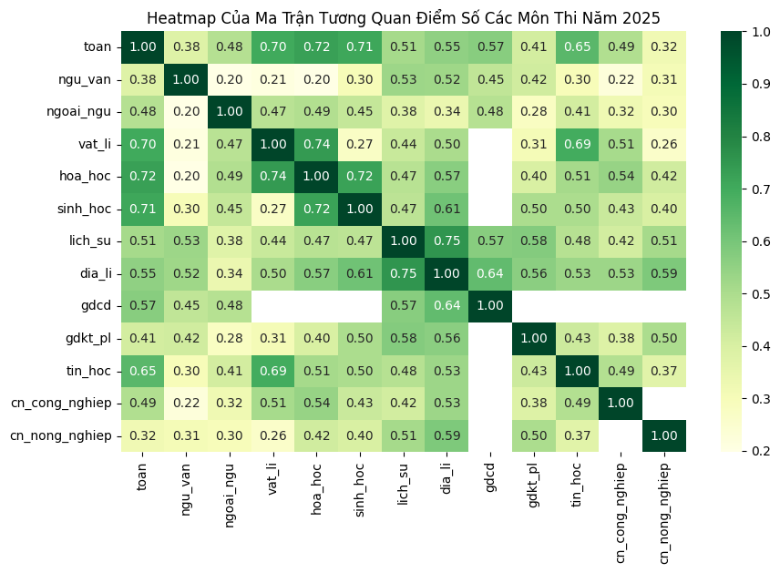
    **1. Nhóm Khoa học Tự nhiên (KHTN): Toán – Lý – Hóa – Sinh**
    Tương quan rất cao và đồng đều:
    - Toán – Hóa: 0.72
    - Toán – Lý: 0.70
    - Hóa – Lý: 0.74
    - Sinh – Hóa: 0.72
    - Toán – Sinh: 0.71
    → Thể hiện tính ổn định, chặt chẽ giữa các môn logic, định lượng.

    **2. Nhóm Khoa học Xã hội (KHXH): Văn – Sử – Địa**
    - Văn – Sử: 0.53
    - Văn – Địa: 0.52
    - Sử – Địa: 0.75 → Rất cao
    → Học sinh thiên hướng xã hội thường học đều 3 môn, có sự liên hệ rõ ràng.

    **3. Ngoại ngữ – môn độc lập rõ rệt**
    Tương quan thấp với tất cả các môn:
    - Văn: 0.20
    - Toán: 0.48
    - Lý: 0.47
    - Hóa: 0.49
    - Sinh: 0.45
    → Cho thấy đây là môn thiên về kỹ năng rèn luyện riêng.

    **4. Tin học – Tăng cường chiều sâu tổ hợp KHTN**
    Tương quan cao với:
    - Toán: 0.65
    - Lý: 0.69
    - Hóa: 0.51
    - Sinh và GDKT-PL: ~0.48
    → Là môn mới nhưng phản ánh đúng khả năng tư duy logic – công nghệ.

    **5. GDKT-PL – môn KHXH mới thay thế GDCD**
    Tương quan cao với:
    - Sử: 0.58
    - Địa: 0.60
    - Văn: 0.42
    - Trung bình với Toán: 0.41, Sinh: 0.50, CN nông nghiệp: 0.50
    → GDKT-PL giữ vai trò thay thế GDCD, nhưng có xu hướng mềm mại hơn, mở hơn về tổ hợp.

    **6. Công nghệ – Hai phân nhánh rõ rệt**
    - **CN Công nghiệp:**
      - Toán: 0.49, Lý: 0.51, Hóa: 0.54, Địa: 0.53
      → Mang đặc điểm gần khối A, khối kỹ thuật – sản xuất.
    - **CN Nông nghiệp:**
      - Toán: 0.32, Lý: 0.26, Hóa: 0.42
      → Phù hợp với nhóm ngành nông – lâm – thực phẩm, không nên kết hợp đại trà.

    **7. GDCD – chỉ còn thí sinh tự do thi**
      - Văn: 0.45, Sử: 0.57, Địa: 0.64
      → Loại khỏi phân tích dành riêng cho học sinh 2k7, nhưng có thể sử dụng trong phân tích nhóm thí sinh tự do.

  - **Combination correlations**: Phân tích mối tương quan giữa các tổ hợp phổ biến

    **Xu hướng chung qua các năm:**
    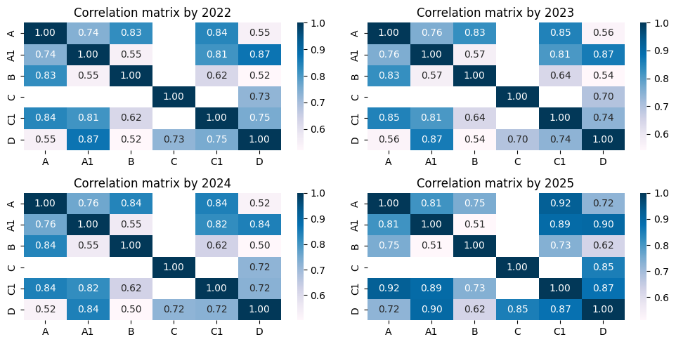
    Các tổ hợp có độ tương quan cao và ổn định qua các năm gồm:
    - **A & C1**: từ 0.84 (2022) → 0.85 (2023) → 0.84 (2024) → 0.92 (2025).
    - **A1 & D**: dao động quanh mức 0.84–0.90, tăng đều qua các năm.
    - **C & D**: giữ ổn định từ 0.70–0.85, có xu hướng tăng nhẹ về 2025.

    Tổ hợp B có độ tương quan thấp hơn rõ rệt với các tổ hợp khác trong tất cả các năm:
    - Nhất là với D (0.52–0.66), A1 (0.55–0.57) → chứng tỏ thí sinh nhóm này khác biệt về học lực hoặc hướng học tập (thiên về KHTN, Sinh học, Y dược).

    **Nhận xét cụ thể theo năm:**
    
    *Năm 2025:*
    - Tương quan giữa các tổ hợp tăng rõ rệt, đặc biệt là các cặp:
      - A–C1 (0.92), A1–D (0.90), C–D (0.85).
    - Điều này cho thấy điểm các tổ hợp đang tiệm cận nhau, có thể do:
      - Thay đổi cấu trúc đề thi/ma trận kiến thức.
      - Sự chuyển dịch xu hướng chọn tổ hợp thi (học sinh học đều hơn nhiều môn).
    - Tổ hợp B vẫn giữ đặc thù riêng, ít tương quan với các tổ hợp còn lại.

    *So với các năm trước (2022–2024):*
    - Giai đoạn 2022–2024:
      - Tương quan giữa các tổ hợp khá ổn định, đặc biệt là A1–D, A–C1, C–D.
      - Một số cặp có sự dao động nhẹ như A1–B hoặc C–B nhưng không đáng kể.

### **Location**
So sánh sự tăng trưởng số lượng thí sinh qua các vùng
- **Bắc Trung Bộ**
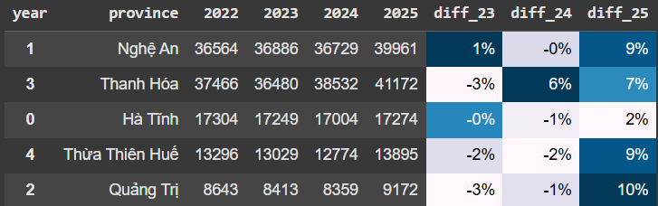
- **Duyên Hải Nam Trung Bộ**
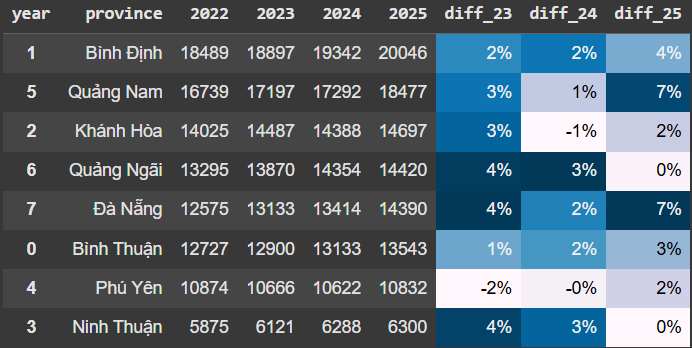
- **Trung du và miền núi phía Bắc**
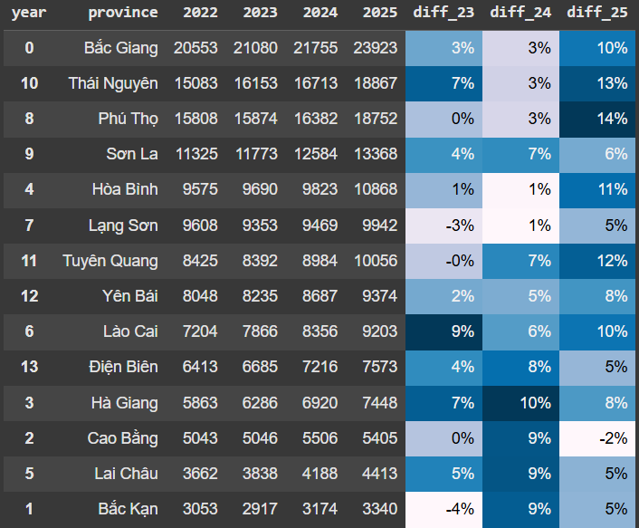
- **Tây Nguyên**
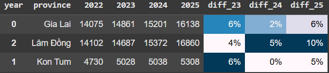
- **Đông Nam Bộ**

- **Đồng bằng sông Hồng**
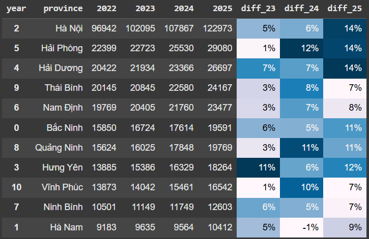
- **Đồng bằng sông Cửu Long**
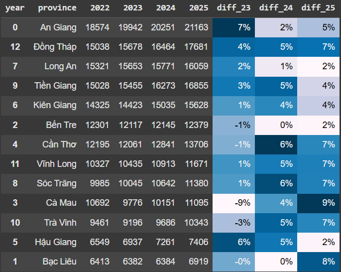

### **Map**
Trực quan hóa top 10 tỉnh có trung vị, độ lệch chuẩn và số lượng thí sinh có điểm số các môn lọt top 5% cao nhất cả nước. 
- **Toán**
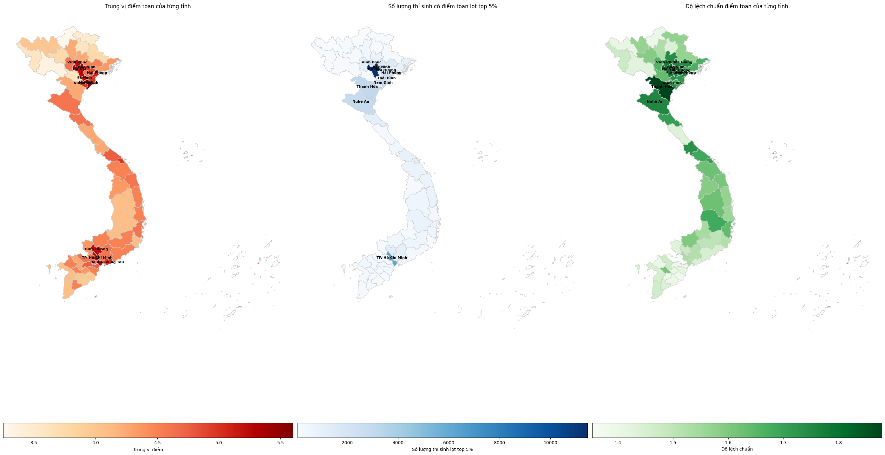

  **1. Trung vị điểm Toán của từng tỉnh (Bản đồ trái)**
  - **Khu vực có trung vị cao (≥5.0)**: Chủ yếu tập trung ở các đô thị lớn như TP. Hồ Chí Minh, Hà Nội, Hải Phòng, Đà Nẵng, Bình Dương, Bà Rịa - Vũng Tàu. Đây là những nơi có điều kiện học tập tốt, cơ sở vật chất phát triển, và tỷ lệ học sinh theo học các trường chuyên/lớp chọn cao.

  - **Khu vực có trung vị thấp (≤4.0)**: Thường thuộc các tỉnh miền núi phía Bắc và Tây Nguyên, nơi điều kiện học tập còn nhiều hạn chế.

  - **Nhận xét**: Trung vị điểm Toán phản ánh tương đối sự chênh lệch về chất lượng giáo dục giữa các vùng miền, đặc biệt là miền núi - thành thị.

  **2. Số lượng thí sinh đạt điểm trong top 5% (Bản đồ giữa)**
  - **Top dẫn đầu về số lượng thí sinh top 5%**: Gồm Hà Nội, TP. HCM, Hải Phòng, Nghệ An, Nam Định, Thái Bình, Thanh Hóa, Vĩnh Phúc.

  - Hà Nội và TP.HCM có số lượng thí sinh đông đảo nên chiếm tỷ trọng lớn.

  - Các tỉnh Bắc Trung Bộ như Nghệ An, Thanh Hóa và đồng bằng sông Hồng như Nam Định, Thái Bình tiếp tục giữ vững truyền thống học tốt môn Toán.

  - **Nhận xét**: Dù TP.HCM có trung vị cao, nhưng Hà Nội vẫn nhỉnh hơn về số lượng học sinh giỏi vượt trội – thể hiện ở số học sinh vào top 5%.

  **3. Độ lệch chuẩn điểm Toán của từng tỉnh (Bản đồ phải)**
  - **Độ lệch chuẩn cao (≥1.7)**: Ghi nhận ở các tỉnh như Nghệ An, Nam Định, Hà Nội, Vĩnh Phúc, cho thấy điểm số có sự phân hóa rõ rệt – tức là có cả học sinh rất giỏi và rất yếu.

  - **Độ lệch chuẩn thấp (≤1.4)**: Ghi nhận chủ yếu ở các tỉnh Tây Nam Bộ và Tây Nguyên, phản ánh mức độ đồng đều (nhưng không đồng nghĩa là điểm cao).

  - **Nhận xét**: Vùng có độ lệch chuẩn cao thường là nơi có chất lượng đào tạo phân tầng – tồn tại cả nhóm học sinh giỏi vượt trội lẫn nhóm yếu.

- **Ngữ Văn**
  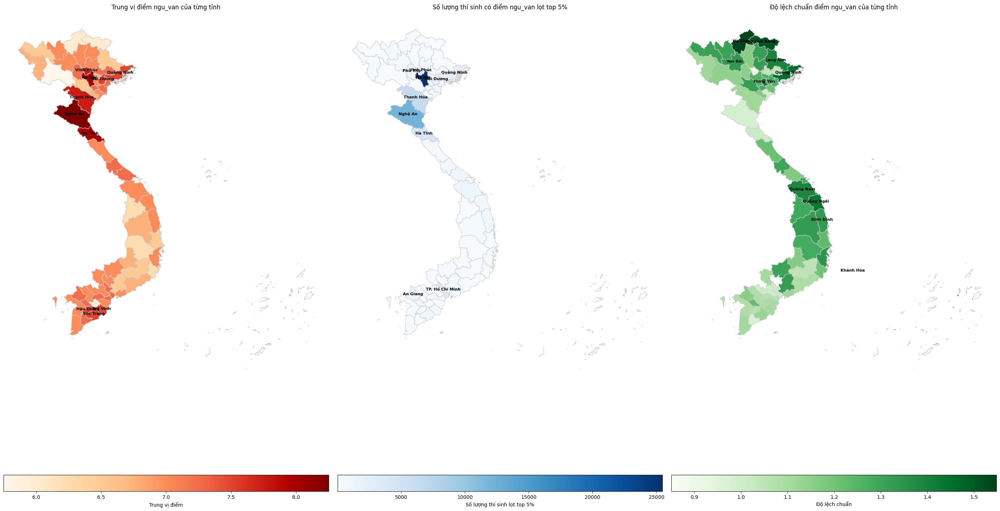

  **1. Trung vị điểm Ngữ Văn của từng tỉnh (Bản đồ trái)**
  - **Khu vực có trung vị cao (≥8.0)**: Bao gồm các tỉnh khu vực Bắc Trung Bộ như Nghệ An, Hà Tĩnh, Thanh Hóa – đặc biệt nổi bật là Nghệ An có trung vị cao nhất cả nước. Một số tỉnh miền Tây như Hậu Giang, Sóc Trăng cũng có trung vị khá cao.

  - **Khu vực có trung vị thấp (≤6.5)**: Tập trung ở các tỉnh miền núi phía Bắc (như Cao Bằng, Hà Giang) và Tây Nguyên, nơi còn nhiều hạn chế về điều kiện học tập và ngôn ngữ.

  - **Nhận xét**: Trung vị điểm Ngữ Văn cho thấy thế mạnh truyền thống của khu vực Bắc Trung Bộ về môn học này, với nền tảng học tập nghiêm túc và tinh thần tự học cao.

  **2. Số lượng thí sinh đạt điểm trong top 5% môn Ngữ Văn (Bản đồ giữa)**
  - **Top dẫn đầu về số lượng thí sinh lọt top 5%**: Gồm các tỉnh như Nghệ An, Thanh Hóa, Hà Tĩnh, TP. Hồ Chí Minh, Phú Thọ, An Giang, Quảng Ninh.

  - TP. Hồ Chí Minh và Nghệ An có số lượng thí sinh top 5% áp đảo – nhờ quy mô dân số lớn và chất lượng giáo dục nổi bật.

  - Các tỉnh như Phú Thọ, Hà Tĩnh và Thanh Hóa cũng cho thấy sự bứt phá mạnh mẽ ở tốp học sinh xuất sắc.

  - **Nhận xét**: Số lượng thí sinh đạt điểm cao không chỉ phụ thuộc vào quy mô dân số, mà còn phản ánh chiều sâu về truyền thống học tốt Ngữ Văn – đặc biệt là các tỉnh Bắc Trung Bộ.

  **3. Độ lệch chuẩn điểm Ngữ Văn của từng tỉnh (Bản đồ phải)**
  - **Độ lệch chuẩn cao (≥1.3)**: Xuất hiện ở một số tỉnh vùng núi phía Bắc như Lạng Sơn, Bắc Kạn, Hà Giang, cho thấy mức độ phân hóa lớn – có cả học sinh giỏi vượt trội lẫn học sinh yếu.

  - **Độ lệch chuẩn thấp (≤1.0)**: Thấy rõ ở các tỉnh phía Nam như Cà Mau, Bạc Liêu, Trà Vinh – phản ánh mức độ đồng đều (dễ đoán) nhưng thường ở mức điểm trung bình-khá.

  - **Nhận xét**: Những nơi có độ lệch chuẩn cao thường là vùng có sự chênh lệch lớn trong chất lượng học sinh – có thể do các trường chuyên nổi bật bên cạnh mặt bằng chung còn thấp.

- **Ngoại Ngữ**
  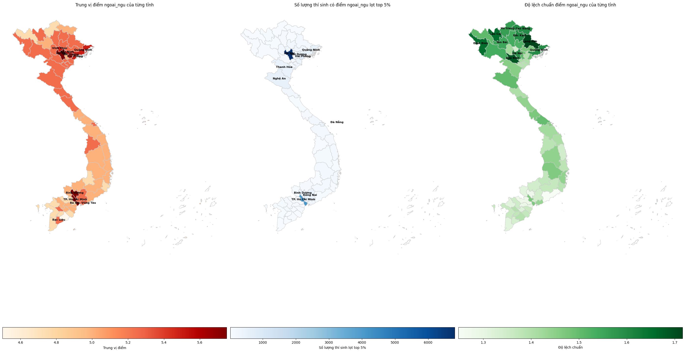

  **1. Trung vị điểm Ngoại ngữ của từng tỉnh (Bản đồ trái)**
  - **Khu vực có trung vị cao (≥5.2)**: Tập trung ở các tỉnh, thành phố lớn như TP. Hồ Chí Minh, Bình Dương, Bà Rịa - Vũng Tàu, Đà Nẵng, Hà Nội, Hải Phòng và Quảng Ninh. Đây là các địa phương có điều kiện học ngoại ngữ tốt, cơ sở vật chất hiện đại, nhiều trung tâm ngoại ngữ và môi trường học tập năng động.

  - **Khu vực có trung vị thấp (≤4.8)**: Chủ yếu thuộc các tỉnh miền núi phía Bắc như Cao Bằng, Hà Giang, Sơn La, Lai Châu và các tỉnh duyên hải miền Trung. Đây là những khu vực còn gặp nhiều khó khăn về cơ sở vật chất và đội ngũ giáo viên tiếng Anh chất lượng.

  - **Nhận xét**: Trung vị điểm môn Ngoại ngữ phản ánh rõ nét sự phân hóa giữa các vùng phát triển (thành thị, công nghiệp) và vùng khó khăn (miền núi, nông thôn), cho thấy ảnh hưởng lớn từ điều kiện học tập và mức độ tiếp cận ngoại ngữ trong đời sống hàng ngày.

  **2. Số lượng thí sinh đạt điểm trong top 5% (Bản đồ giữa)**
  - **Top dẫn đầu về số lượng thí sinh top 5%**: Gồm Hà Nội, TP. Hồ Chí Minh, Hải Phòng, Quảng Ninh, Thanh Hóa, Nghệ An, Bình Dương, Đồng Nai.

  - Hà Nội vượt trội với số lượng thí sinh top 5% đông đảo nhất cả nước, cho thấy mặt bằng chung rất cao và xuất hiện nhiều học sinh xuất sắc.

  - TP. Hồ Chí Minh và các tỉnh công nghiệp phía Nam như Bình Dương, Đồng Nai cũng có số lượng thí sinh top 5% lớn, nhờ quy mô dân số và môi trường học ngoại ngữ năng động.

  - **Nhận xét**: Mặc dù các tỉnh miền núi có tỷ lệ trung vị điểm thấp, nhưng các đô thị lớn tiếp tục dẫn đầu cả về số lượng và chất lượng thí sinh học tốt Ngoại ngữ, phản ánh đầu tư giáo dục và môi trường học tập quốc tế.

  **3. Độ lệch chuẩn điểm Ngoại ngữ của từng tỉnh (Bản đồ phải)**
  - **Độ lệch chuẩn cao (≥1.6)**: Ghi nhận chủ yếu ở các tỉnh phía Bắc như Hà Nội, Bắc Ninh, Hưng Yên, Hải Dương, Nam Định, Thái Bình, cho thấy sự phân hóa rõ nét – có nhiều học sinh giỏi xuất sắc nhưng cũng tồn tại học sinh yếu.

  - **Độ lệch chuẩn thấp (≤1.3)**: Xuất hiện nhiều ở khu vực miền Trung và Tây Nam Bộ như Đắk Nông, Bình Thuận, Sóc Trăng, Bạc Liêu – nơi phổ điểm đồng đều nhưng nhìn chung ở mức thấp.

  - **Nhận xét**: Độ lệch chuẩn cao thể hiện sự phân tầng chất lượng học sinh trong tỉnh – phù hợp với các khu vực có nhiều trường chuyên, trung tâm đào tạo, nhưng cũng tồn tại khoảng cách giữa các nhóm học sinh. Độ lệch chuẩn thấp không đồng nghĩa với học lực cao – nhiều nơi có điểm đều nhưng ở mức trung bình – yếu.

### **Area Analysis**
Kết hợp phân tích các tổ hợp môn giữa các vùng miền Bắc - Trung - Nam để đánh giá và dự đoán điểm chuẩn giữa các trường top đầu của từng miền.

  **1. Tổ hợp A00 (Toán - Lý - Hóa):**
  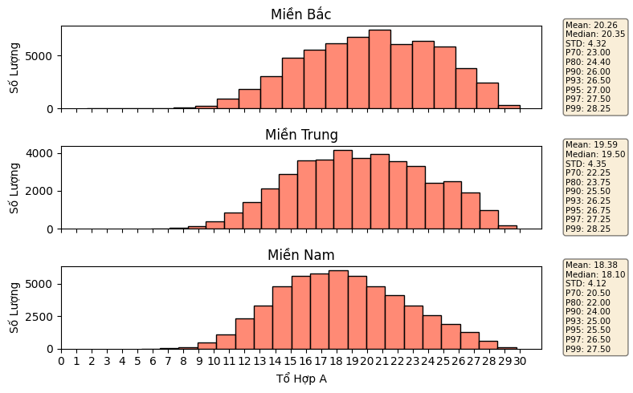
  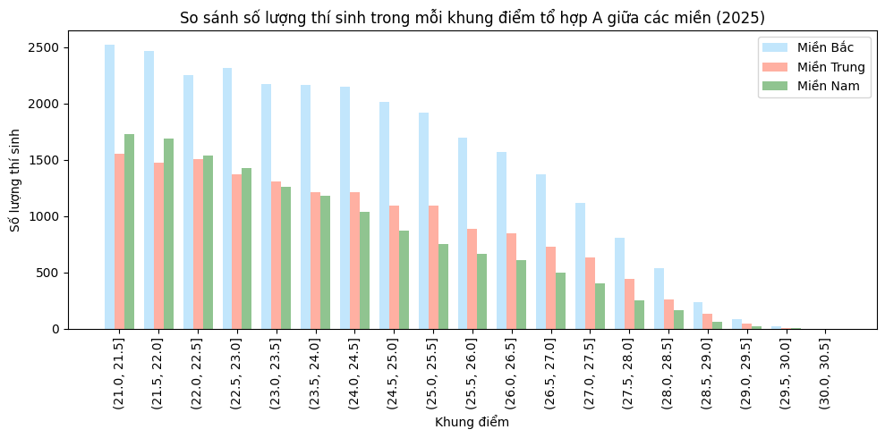
  - **Thống kê mô tả:**
    - **Dạng phân phối:**
      - **Miền Bắc**: Phân phối gần chuẩn, đỉnh lệch nhẹ về trái. Phổ rộng, dàn đều từ 15 đến 27 điểm.
      - **Miền Trung**: Phân phối cân đối, đỉnh nằm sát trung bình. Phổ khá tập trung, dẹt nhẹ ở hai đầu.
      - **Miền Nam**: Phân phối hơi lệch phải, đỉnh rõ ở mức 17–18 điểm, đuôi phải ngắn hơn.
      
      → So với các năm trước, năm 2025 cho thấy sự phân hóa rõ rệt hơn giữa các vùng, với Miền Bắc có phổ điểm cao và rộng nhất, còn Miền Nam có điểm trung bình thấp nhất và ít thí sinh điểm cao.
    - **Thông số thống kê nổi bật:**
      - **Miền Bắc:**
        - Mean: 20.26 – Median: 20.35 – STD: 4.32
        - P95: 27.00 – P99: 28.25
      - **Miền Trung:**
        - Mean: 19.59 – Median: 19.50 – STD: 4.35
        - P95: 26.75 – P99: 28.25
      - **Miền Nam:**
        - Mean: 18.38 – Median: 18.10 – STD: 4.12
        - P95: 26.00 – P99: 27.50
      
      → Điểm trung bình có xu hướng giảm dần từ Bắc → Trung → Nam, trong khi độ lệch chuẩn giữa các miền không quá chênh lệch.

  - **Số lượng thí sinh trong range điểm top 5% (từ P95 trở lên):**
    - **Ngưỡng P95 theo vùng:**
      - Miền Bắc: 27.00
      - Miền Trung: 26.75
      - Miền Nam: 26.00
    - **So sánh số lượng thí sinh đạt ngưỡng top 5%:**
      - Biểu đồ cột khung điểm cho thấy:
        - Từ ngưỡng 26.5 trở lên, Miền Bắc vượt trội về số lượng thí sinh, đặc biệt ở các khoảng 26.5–28.5.
        - Miền Trung theo sau, còn Miền Nam gần như không có thí sinh đạt từ 28 trở lên.
        - Tổng thể, Miền Bắc chiếm ưu thế tuyệt đối ở phân khúc top, cho thấy chất lượng thí sinh cao hơn và đồng đều hơn.
      
      → Ước tính toàn quốc có khoảng 2.500–3.000 thí sinh đạt ≥26.5 điểm, trong đó Miền Bắc chiếm tỷ lệ lớn nhất.

  - **Dự đoán điểm chuẩn các trường top đầu/ngành hot (phân theo vùng):**
    - **Miền Bắc:**
      - Sở hữu phổ điểm cao và dàn đều, đặc biệt số lượng thí sinh từ 26–28 điểm rất lớn.
      - Dự đoán điểm chuẩn ngành top: 26.5 – 27.5, thậm chí có thể chạm 28.0 ở những trường top 1.
      - Cạnh tranh cực kỳ gay gắt, thí sinh phải thuộc top 3% toàn miền mới có khả năng trúng tuyển.
    - **Miền Trung:**
      - Phổ điểm ổn định, đỉnh lệch trái nhẹ nhưng vẫn có lượng thí sinh đạt 25–27 điểm khá nhiều.
      - Dự đoán điểm chuẩn ngành top: khoảng 25.5 – 26.5.
      - Tỷ lệ cạnh tranh vẫn cao nhưng thấp hơn miền Bắc, cơ hội cho thí sinh 25+ vẫn rõ rệt.
    - **Miền Nam:**
      - Phổ điểm thấp hơn rõ rệt, ít thí sinh đạt điểm từ 26 trở lên.
      - Dự đoán điểm chuẩn ngành top: khoảng 24.5 – 26.0, khó có ngành vượt quá 26.5.
      - Với mặt bằng điểm thấp hơn, thí sinh 25+ đã có nhiều cơ hội trúng tuyển hơn.

  - **Nếu tổ hợp A00 phải cạnh tranh với các tổ hợp khác (A01, D01...):**
    - A00 có thể yếu thế nếu các tổ hợp khác có phân phối điểm cao và lệch phải hơn.
    - Đặc biệt trong miền Nam, nếu thí sinh thi A01/D01 có điểm cao hơn thì các trường có thể chuyển ưu tiên xét tuyển về các tổ hợp đó (nếu không quy đổi điểm chuẩn theo tổ hợp).
    - Khuyến nghị: Thí sinh A00 nên đăng ký vào trường/ngành có chỉ tiêu riêng hoặc ưu tiên A00 để tránh bất lợi.

  **2. Tổ hợp A01 (Toán - Lý - Anh):**
  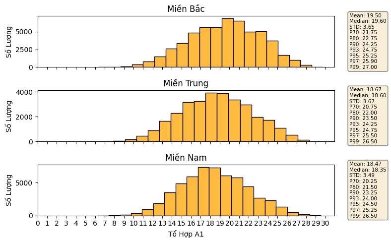
  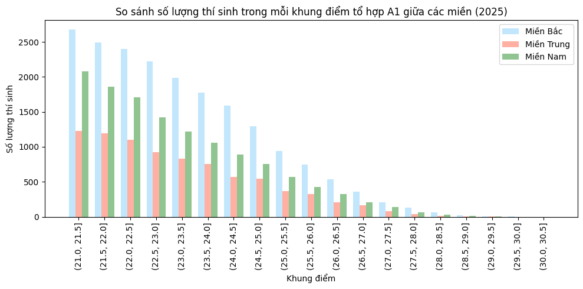
  - **Thống kê mô tả:**
    - **Dạng phân phối:**
      - **Miền Bắc**: Phân phối gần chuẩn, đỉnh lệch nhẹ về trái. Phổ điểm rộng, trải đều từ 13 đến 27 điểm. Phân khúc từ 21–25 điểm đặc biệt dày.
      - **Miền Trung**: Phân phối cân đối, đỉnh nằm gần trung bình (~19 điểm). Phổ điểm tập trung trong khoảng 15–24 điểm, ít thí sinh đạt điểm cực cao.
      - **Miền Nam**: Phân phối hơi lệch phải, đỉnh nằm ở mức 17–18 điểm, sau đó giảm nhanh. Phổ hẹp hơn, số thí sinh điểm cao ít hơn hẳn.
      
      → Miền Bắc tiếp tục thể hiện ưu thế rõ rệt về chất lượng đầu vào, với phân phối rộng và nhiều thí sinh điểm cao. Miền Trung ổn định nhưng ít đột phá. Miền Nam có phổ điểm thấp hơn đáng kể, khó cạnh tranh ở nhóm ngành top nếu xét toàn quốc.
    - **Thông số thống kê nổi bật:**
      - **Miền Bắc:**
        - Mean: 19.50 – Median: 19.60 – STD: 3.65
        - P95: 25.25 – P99: 27.00
      - **Miền Trung:**
        - Mean: 18.67 – Median: 18.60 – STD: 3.67
        - P95: 24.75 – P99: 26.50
      - **Miền Nam:**
        - Mean: 18.47 – Median: 18.35 – STD: 3.49
        - P95: 24.25 – P99: 26.50
      
      → Điểm trung bình có xu hướng giảm từ Bắc → Trung → Nam. Tuy vậy, độ lệch chuẩn không chênh lệch nhiều, cho thấy sự phân hóa trong mỗi miền vẫn hiện diện rõ.

  - **Số lượng thí sinh trong range điểm top 5% (từ P95 trở lên):**
    - **Ngưỡng P95 theo vùng:**
      - Miền Bắc: 25.25
      - Miền Trung: 24.75
      - Miền Nam: 24.25
    - **So sánh số lượng thí sinh đạt ngưỡng top 5% (qua biểu đồ khung điểm):**
      - Miền Bắc chiếm ưu thế tuyệt đối trong khung điểm từ 25.0 trở lên, nhất là các khoảng 25.5 – 27.0.
      - Miền Trung có xu hướng giảm nhanh sau ngưỡng 24.5, và số lượng đạt 26+ không đáng kể.
      - Miền Nam gần như không có thí sinh vượt 27 điểm, số lượng từ 25.5 trở lên cũng thấp hơn rõ rệt.
      
      → Ước tính toàn quốc có khoảng 2.000–2.500 thí sinh đạt ≥25.5 điểm, trong đó phần lớn thuộc miền Bắc.

  - **Dự đoán điểm chuẩn các trường top đầu/ngành hot (phân theo vùng):**
    - **Miền Bắc:**
      - Phổ điểm cao và dàn đều, số lượng thí sinh ≥25 rất lớn.
      - Dự đoán điểm chuẩn các ngành top: 25.5 – 27.0, thậm chí 27.5 ở một số trường top đầu.
      - Thí sinh muốn vào ngành hot cần nằm trong top 5% miền Bắc.
    - **Miền Trung:**
      - Mức điểm ổn định nhưng không quá cao, cạnh tranh ở mức vừa.
      - Dự đoán điểm chuẩn ngành hot: 24.5 – 26.0.
      - Vẫn có cơ hội cho nhóm thí sinh 24+ nhưng sẽ căng ở các ngành hot.
    - **Miền Nam:**
      - Mặt bằng điểm thấp hơn, ít thí sinh trên 26 điểm.
      - Dự đoán điểm chuẩn ngành hot: 23.5 – 25.5, ít khả năng vượt quá 26.
      - Thí sinh ≥24 điểm đã có nhiều cơ hội vào các ngành top tại miền này.

  - **Nếu tổ hợp A01 cạnh tranh với các tổ hợp khác (A00, D01...):**
    - A01 vẫn giữ được ưu thế ở các trường thiên về Toán - Lý - Anh, tuy nhiên nếu tổ hợp khác (như D01) có phân phối điểm cao hơn, A01 có thể bị lép vế trong xét tuyển chung.
    - Miền Nam dễ bị ảnh hưởng nhất vì mặt bằng điểm A01 thấp, các trường có thể nghiêng về tổ hợp D01 nếu thí sinh đạt điểm cao hơn.
    - Gợi ý: Thí sinh A01 nên ưu tiên trường/ngành có chỉ tiêu riêng cho tổ hợp này hoặc sử dụng các phương án xét tuyển bổ sung (học bạ, chứng chỉ...).
  
  **3. Tổ hợp B00 (Toán - Hóa - Sinh):**
  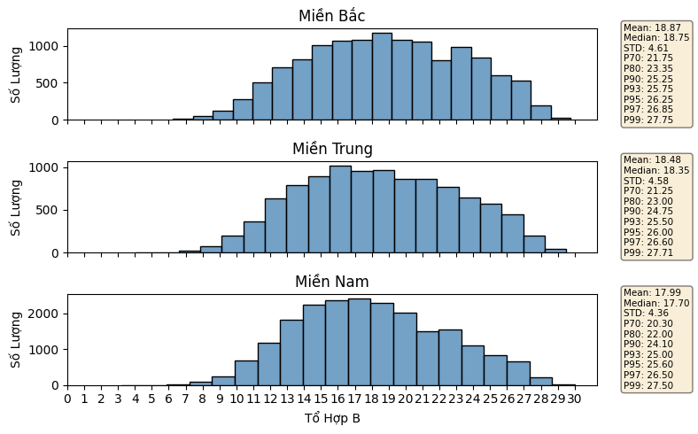
  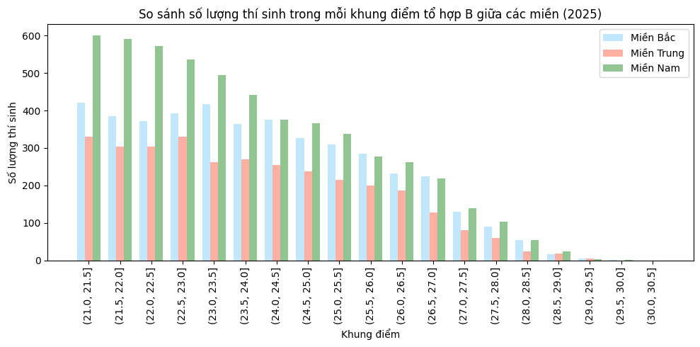
  - **Thống kê mô tả:**
    - **Dạng phân phối:**
      - **Miền Bắc**: Phân phối gần chuẩn, đỉnh hơi lệch trái. Dải điểm rộng, dao động từ 10 đến gần 30 điểm, tập trung nhiều ở khoảng 18–22 điểm.
      - **Miền Trung**: Phân phối cân đối, tập trung cao ở giữa với dải điểm hẹp hơn. Phân bố đồng đều nhưng số lượng đỉnh thấp hơn.
      - **Miền Nam**: Phân phối lệch phải nhẹ, đỉnh cao rõ rệt ở khoảng 17–18 điểm. Số thí sinh ở vùng điểm cao giảm nhanh, đuôi phải ngắn.
      
      → Miền Bắc tiếp tục dẫn đầu về phổ điểm và độ đa dạng, trong khi miền Nam cho thấy sự tụt giảm về chất lượng điểm so với các vùng khác.
    - **Thông số thống kê nổi bật:**
      - **Miền Bắc:**
        - Mean: 18.87 – Median: 18.75 – STD: 4.61
        - P95: 26.25 – P99: 27.75
      - **Miền Trung:**
        - Mean: 18.48 – Median: 18.35 – STD: 4.58
        - P95: 26.00 – P99: 27.71
      - **Miền Nam:**
        - Mean: 17.99 – Median: 17.70 – STD: 4.36
        - P95: 25.50 – P99: 27.50
      
      → Trung bình điểm vẫn giảm dần từ Bắc → Trung → Nam. Mức lệch chuẩn không chênh nhau nhiều nhưng Miền Bắc và Trung có nhiều thí sinh đạt mức điểm cao hơn rõ rệt.

  - **Số lượng thí sinh trong range điểm top 5% (từ P95 trở lên):**
    - **Ngưỡng P95 theo vùng:**
      - Miền Bắc: 26.25
      - Miền Trung: 26.00
      - Miền Nam: 25.50
    - **So sánh số lượng thí sinh đạt ngưỡng top 5%:**
      - Biểu đồ cho thấy:
        - Miền Bắc áp đảo số thí sinh từ khoảng 26.5 trở lên.
        - Miền Trung vẫn duy trì lượng thí sinh khá tốt trong khoảng 26–27 điểm, nhưng ít hơn miền Bắc.
        - Miền Nam gần như không có thí sinh đạt mức từ 28 trở lên.
        - Từ khung điểm 27.0 trở lên, khoảng cách giữa miền Bắc và các vùng còn lại giãn rộng đáng kể.
      
      → Ước tính toàn quốc có khoảng 2.000–2.500 thí sinh đạt ≥26.5 điểm tổ hợp B, trong đó phần lớn thuộc về miền Bắc.

  - **Dự đoán điểm chuẩn các trường top đầu/ngành hot (phân theo vùng):**
    - **Miền Bắc:**
      - Phổ điểm rộng và đỉnh cao, số lượng lớn thí sinh đạt từ 26 trở lên.
      - Dự đoán điểm chuẩn ngành hot dao động: 26.5 – 27.5, thậm chí có ngành có thể vượt mốc 28.0.
      - Cạnh tranh khốc liệt, thí sinh cần nằm trong top 3–4% để trúng tuyển nhóm ngành y dược, công nghệ.
    - **Miền Trung:**
      - Điểm cao tuy không vượt trội nhưng vẫn giữ sự ổn định.
      - Dự đoán điểm chuẩn ngành hot: 25.5 – 26.5.
      - Thí sinh có điểm từ 25.0 trở lên vẫn có cơ hội vào trường top nếu xét tuyển phù hợp.
    - **Miền Nam:**
      - Mặt bằng điểm thấp hơn, phổ điểm không rộng, số thí sinh đạt 26+ ít.
      - Dự đoán điểm chuẩn ngành hot: 24.5 – 26.0, khó có ngành vượt quá 26.5.
      - Với điểm từ 25 trở lên, khả năng đậu cao ở nhiều trường top 2.

  - **Nếu tổ hợp B phải cạnh tranh với các tổ hợp khác (A00, D01...):**
    - Tổ hợp B có thể gặp bất lợi nếu các tổ hợp khác (như A00) có phân phối lệch phải nhiều hơn (nhiều thí sinh điểm cao).
    - Các ngành kỹ thuật, công nghệ nếu không xét riêng theo tổ hợp có thể nghiêng về tổ hợp có phổ điểm cao hơn (A00, A01).
    - **Khuyến nghị:**
      - Thí sinh thi tổ hợp B nên ưu tiên chọn trường/ngành xét riêng tổ hợp này hoặc có tỷ trọng môn Sinh cao.
      - Nếu xét cùng với các tổ hợp khác, cần so sánh kỹ mặt bằng điểm và điểm chuẩn các năm trước để có chiến lược phù hợp.

  **4. Tổ hợp C00 (Văn - Sử - Địa):**
  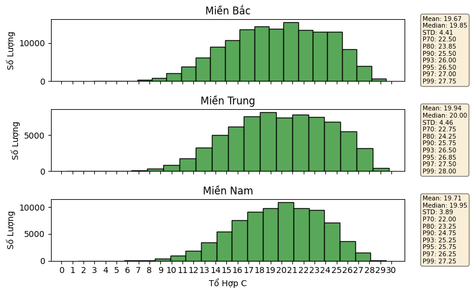
  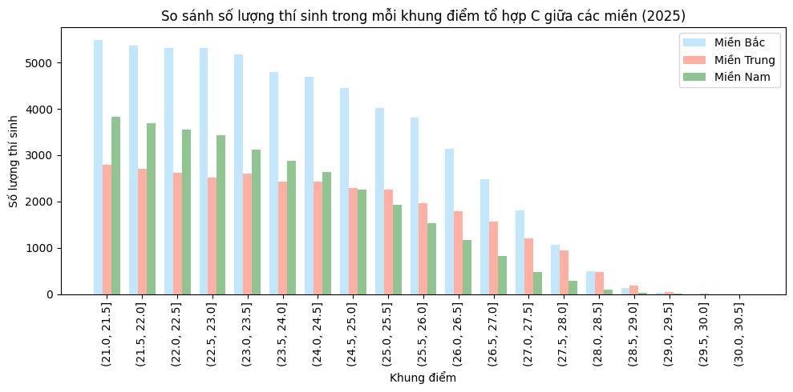

  - **Thống kê mô tả:**
    - **Dạng phân phối:**
      - **Miền Bắc**: Phân phối gần chuẩn, đỉnh lệch nhẹ về trái. Phổ trải rộng từ 15 đến gần 28 điểm, với phần đuôi phải dài hơn Miền Nam.
      - **Miền Trung**: Phân phối khá cân đối, đỉnh rơi quanh 19–21 điểm, dẹt nhẹ ở hai đầu.
      - **Miền Nam**: Phân phối lệch phải, tập trung nhiều ở mức điểm 17–20, đuôi phải ngắn hơn, rất ít thí sinh trên 27.
      
      → Nhìn chung, miền Bắc tiếp tục chiếm ưu thế về phổ điểm rộng và chất lượng thí sinh đồng đều hơn. Miền Nam vẫn tụt lại về phổ điểm và phân hóa kém rõ nét ở nhóm điểm cao.
      
    - **Thông số thống kê nổi bật:**
      - **Miền Bắc:**
        - Mean: 19.67 – Median: 19.85 – STD: 4.41
        - P95: 26.50 – P99: 27.75
      - **Miền Trung:**
        - Mean: 19.94 – Median: 20.00 – STD: 4.46
        - P95: 26.85 – P99: 28.00
      - **Miền Nam:**
        - Mean: 19.71 – Median: 19.95 – STD: 3.89
        - P95: 26.25 – P99: 27.25
      
      → Điểm trung bình của cả 3 miền dao động quanh mức 19.7–19.9, tuy nhiên độ lệch chuẩn của Miền Nam nhỏ hơn, cho thấy mức độ phân hóa kém hơn. Miền Trung có giá trị P99 cao nhất (28.00).

  - **Số lượng thí sinh trong range điểm top 5% (từ P95 trở lên):**
    - **Ngưỡng P95 theo từng miền:**
      - Miền Bắc: 26.50
      - Miền Trung: 26.85
      - Miền Nam: 26.25
    - **So sánh số lượng thí sinh đạt ngưỡng top 5% (dựa theo biểu đồ cột):**
      - Miền Bắc chiếm ưu thế tuyệt đối trong các khoảng từ 26.5 đến 28 điểm.
      - Miền Trung bám sát ở nhóm 26.5–27.5, tuy nhiên thấp hơn ở mức ≥28.
      - Miền Nam có rất ít thí sinh đạt từ 27 trở lên, lượng giảm mạnh từ mốc 26.5.
      
      → Dễ thấy Miền Bắc vẫn là khu vực có nhiều thí sinh nổi trội nhất, đặc biệt từ khung điểm 27.0 trở lên – là điểm "vượt trội tuyệt đối". Miền Nam có sự tụt lại khá rõ, nhất là ở các khung điểm cao.

  - **Dự đoán điểm chuẩn các trường top đầu/ngành hot (phân theo vùng):**
    - **Miền Bắc:**
      - Số lượng lớn thí sinh đạt từ 26–28 điểm tạo lợi thế lớn cho các trường top.
      - Dự đoán điểm chuẩn: 26.5 – 27.5, có ngành chạm ngưỡng 28.
      - Khả năng cạnh tranh rất cao, đặc biệt với thí sinh tổ hợp C.
    - **Miền Trung:**
      - Dự đoán điểm chuẩn ngành hot khoảng 25.5 – 26.5, thậm chí có thể cao hơn nếu so sánh nội vùng.
      - Với phân phối dẹt nhẹ, thí sinh cần thuộc top 7–10% để an toàn.
    - **Miền Nam:**
      - Dự đoán điểm chuẩn ngành hot dao động 24.5 – 26.0.
      - Phổ điểm hẹp và đuôi phải ngắn khiến các trường khó vượt mốc 26.5.

  - **Nếu tổ hợp C phải cạnh tranh với các tổ hợp khác (A00, D01...):**
    - Tổ hợp C có phổ điểm ổn định, nhưng vẫn có thể lép vế nếu tổ hợp A00/D01 có độ lệch chuẩn lớn và đỉnh lệch phải.
    - Một số ngành KHXH thường ưu tiên tổ hợp C, tuy nhiên thí sinh vẫn nên theo dõi chỉ tiêu cụ thể.
    - **Khuyến nghị**: Thí sinh tổ hợp C nên ưu tiên các ngành có truyền thống tuyển C, đồng thời tận dụng điểm mạnh về phổ điểm dàn đều ở Miền Bắc.

  **5. Tổ hợp C01 (Toán - Văn - Lý):**
  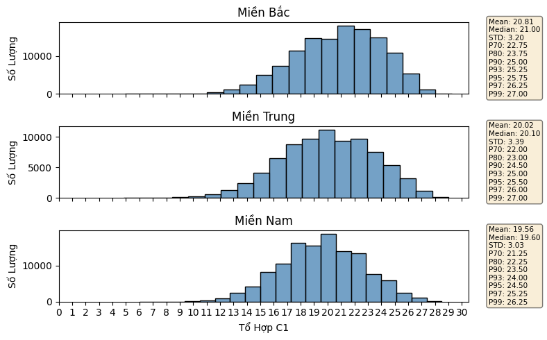
  

  - **Thống kê mô tả:**
    - **Dạng phân phối:**
      - **Miền Bắc**: Phân phối gần chuẩn, đỉnh lệch nhẹ về trái. Phổ rộng, kéo dài từ 14 đến 28 điểm. Tỷ trọng thí sinh khá dàn đều ở nhóm 20–26 điểm.
      - **Miền Trung**: Phân phối cân đối, đỉnh nằm gần trung bình. Phổ dàn trải từ khoảng 13 đến 27 điểm. Đuôi hai bên không quá dài.
      - **Miền Nam**: Phân phối lệch phải, tập trung rõ rệt ở mức 17–20 điểm. Từ 24 điểm trở lên bắt đầu hiếm dần.
      
      → Sự phân hóa rõ rệt thể hiện qua hình dạng phân phối. Miền Bắc có phổ điểm rộng và nhiều thí sinh điểm cao, Miền Nam thì tụt lại khá rõ, tập trung ở khoảng điểm trung bình thấp.
      
    - **Thông số thống kê nổi bật:**
      - **Miền Bắc:**
        - Mean: 20.81 – Median: 21.00 – STD: 3.20
        - P95: 25.75 – P99: 27.00
      - **Miền Trung:**
        - Mean: 20.02 – Median: 20.10 – STD: 3.39
        - P95: 25.50 – P99: 27.00
      - **Miền Nam:**
        - Mean: 19.56 – Median: 19.60 – STD: 3.03
        - P95: 24.50 – P99: 26.25
      
      → Trung bình điểm giảm dần từ Bắc → Trung → Nam, tuy nhiên độ lệch chuẩn vẫn tương đối gần nhau.

  - **Số lượng thí sinh trong range điểm top 5% (từ P95 trở lên):**
    - **Ngưỡng P95 theo vùng:**
      - Miền Bắc: 25.75
      - Miền Trung: 25.50
      - Miền Nam: 24.50
    - **So sánh số lượng thí sinh đạt ngưỡng top 5%:**
      - Theo biểu đồ cột, Miền Bắc chiếm ưu thế áp đảo trong các khung điểm từ 25.5 trở lên.
      - Miền Trung vẫn có hiện diện ở nhóm điểm cao, nhưng thấp hơn Miền Bắc rõ rệt.
      - Miền Nam gần như "mất hút" từ ngưỡng 26 điểm trở lên, số lượng thí sinh rất ít.
      
      → Miền Bắc có tỷ trọng thí sinh top cao vượt trội, cho thấy chất lượng và sự đồng đều tốt hơn hẳn.

  - **Dự đoán điểm chuẩn các trường top đầu/ngành hot (phân theo vùng):**
    - **Miền Bắc:**
      - Số lượng thí sinh 25+ rất lớn, tạo nên mặt bằng điểm cao.
      - Dự đoán điểm chuẩn ngành hot: 26.0 – 27.5, có thể chạm 28.0 ở khối công an, quân đội, y đa khoa, CNTT ĐH Bách Khoa HN.
      - Tỷ lệ chọi ở các trường top cực cao, cạnh tranh khốc liệt.
    - **Miền Trung:**
      - Phổ điểm ổn định, có thí sinh đạt đến 27 nhưng ít hơn miền Bắc.
      - Dự đoán điểm chuẩn ngành hot: 25.0 – 26.5
      - Một số trường lớn tại Đà Nẵng, Huế vẫn có khả năng lấy cao nhưng không quá 27.
    - **Miền Nam:**
      - Phổ điểm thấp hơn, thí sinh ≥26 ít.
      - Dự đoán điểm chuẩn ngành hot: 24.5 – 26.0
      - Khó có ngành nào vượt quá 26.5, thậm chí các ngành hot ở ĐHQG TP.HCM cũng có thể quanh mốc 25.5–26.0.

  - **Nếu tổ hợp C1 phải cạnh tranh với các tổ hợp khác (C00, D01, A01...):**
    - C1 có thể mất lợi thế nếu các tổ hợp như D01, A01 có phân phối lệch phải hơn (nhiều điểm cao hơn).
    - Các trường có thể ưu tiên xét tuyển tổ hợp có mặt bằng điểm cao nếu không quy đổi về chuẩn chung.
    - **Khuyến nghị**: Thí sinh thi C1 nên ưu tiên trường/ngành dùng điểm chuẩn riêng cho C1 hoặc xác định rõ chính sách xét tuyển của từng trường.

  **6. Tổ hợp D01 (Toán - Văn - Anh):**
  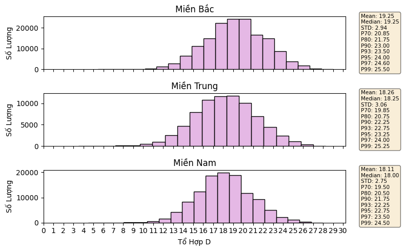
  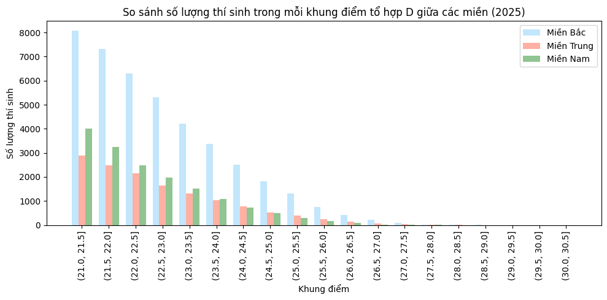
  - **Thống kê mô tả:**
    - **Dạng phân phối:**
      - **Miền Bắc**: Phân phối gần chuẩn, đỉnh lệch nhẹ về trái. Phổ rộng, dàn đều từ 13 đến 28 điểm.
      - **Miền Trung**: Phân phối cân đối, đỉnh nằm sát trung bình. Phổ khá tập trung, dẹt nhẹ ở hai đầu.
      - **Miền Nam**: Phân phối hơi lệch phải, đỉnh rõ ở mức 17–18 điểm, đuôi phải ngắn hơn.
      
      → Phổ điểm tổ hợp D năm 2025 cho thấy sự phân hóa khá rõ giữa các miền, trong đó Miền Bắc nổi bật với phổ điểm cao và rộng nhất, Miền Nam thấp và tập trung hơn.
      
    - **Thông số thống kê nổi bật:**
      - **Miền Bắc:**
        - Mean: 19.25 – Median: 19.25 – STD: 2.94
        - P95: 24.60 – P99: 25.50
      - **Miền Trung:**
        - Mean: 18.26 – Median: 18.25 – STD: 3.06
        - P95: 23.25 – P99: 25.25
      - **Miền Nam:**
        - Mean: 18.11 – Median: 18.00 – STD: 2.75
        - P95: 23.50 – P99: 24.50

      → Trung bình điểm giảm nhẹ từ Bắc → Trung → Nam. Miền Bắc có mức cao nhất và độ phân tán cũng rộng nhất (theo độ lệch chuẩn và percentiles).

  - **Số lượng thí sinh trong range điểm top 5% (từ P95 trở lên):**
    - **Ngưỡng P95 theo vùng:**
      - Miền Bắc: 24.60
      - Miền Trung: 23.25
      - Miền Nam: 23.50
    - **So sánh số lượng thí sinh đạt ngưỡng top 5%:**
      - Miền Bắc vượt trội rõ rệt về số lượng thí sinh đạt trên 24.5 điểm.
      - Từ mức 25.0 trở lên, khoảng cách giữa Miền Bắc và 2 miền còn lại ngày càng lớn.
      - Miền Trung có độ rơi chậm hơn Miền Nam, nhưng vẫn thấp hơn Miền Bắc đáng kể.
      - Miền Nam gần như không có thí sinh từ 26 điểm trở lên.
      
      → Ước tính số thí sinh ≥25 điểm chủ yếu tập trung tại Miền Bắc, củng cố ưu thế cạnh tranh ở các ngành hot.

  - **Dự đoán điểm chuẩn các trường top đầu/ngành hot (phân theo vùng):**
    - **Miền Bắc:**
      - Phổ điểm cao và số lượng thí sinh ≥25 rất lớn.
      - Dự đoán điểm chuẩn ngành top: 25.5 – 27.0.
      - Những ngành hot (Bách khoa, Kinh tế, Ngoại thương) có thể cán mốc 27.
    - **Miền Trung:**
      - Điểm không quá cao nhưng khá ổn định.
      - Dự đoán điểm chuẩn ngành top: khoảng 24.5 – 26.0.
      - Một số ngành hot như CNTT, Y Dược ở Đà Nẵng vẫn sẽ cạnh tranh.
    - **Miền Nam:**
      - Mặt bằng thấp hơn, số thí sinh điểm cao ít.
      - Dự đoán điểm chuẩn ngành top: 23.5 – 25.5.
      - Dễ trúng tuyển hơn nhưng vẫn cần ≥25 với các ngành top như Y dược, CNTT, Kinh tế.

  - **Nếu tổ hợp D phải cạnh tranh với các tổ hợp khác (C00, D01, A01...):**
    - Dễ bị lép vế nếu A00/A01 có phổ điểm cao hơn.
    - Tại miền Nam, tổ hợp A01 có thể được ưu tiên nếu thí sinh đạt điểm cao hơn.
    - Thí sinh tổ hợp D cần cân nhắc trường/ngành ưu tiên rõ tổ hợp xét tuyển.

## **3. Conclusion**

- Năm 2025 có sự phân hóa mạnh mẽ về điểm thi, đặc biệt ở các môn như Toán và Ngoại ngữ.
- Các tổ hợp truyền thống như A00, B00 chứng kiến mức điểm trung bình giảm, nhưng tăng độ phân hóa → giúp chọn lọc thí sinh xuất sắc rõ hơn.
- Miền Bắc tiếp tục dẫn đầu về số lượng và chất lượng thí sinh điểm cao; Miền Nam có phổ điểm thấp hơn.
- Dự đoán điểm chuẩn ngành top năm 2025 có xu hướng giữ nguyên hoặc giảm nhẹ, trừ một số tổ hợp đặc thù có thể tăng do thí sinh điểm cao ít.

> Tổng thể, kỳ thi năm 2025 hướng đến tính phân loại và công bằng trong tuyển sinh đại học.
